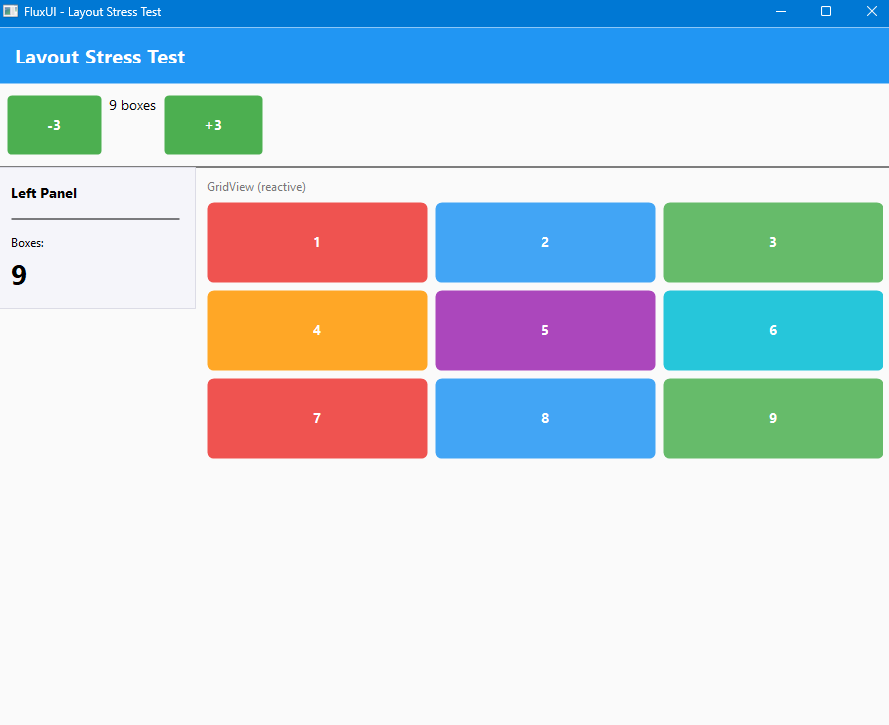
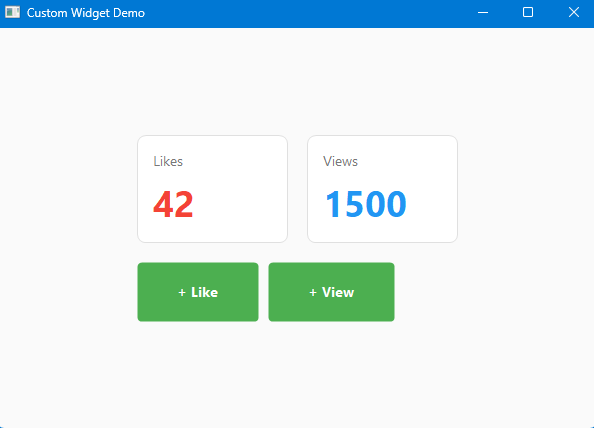
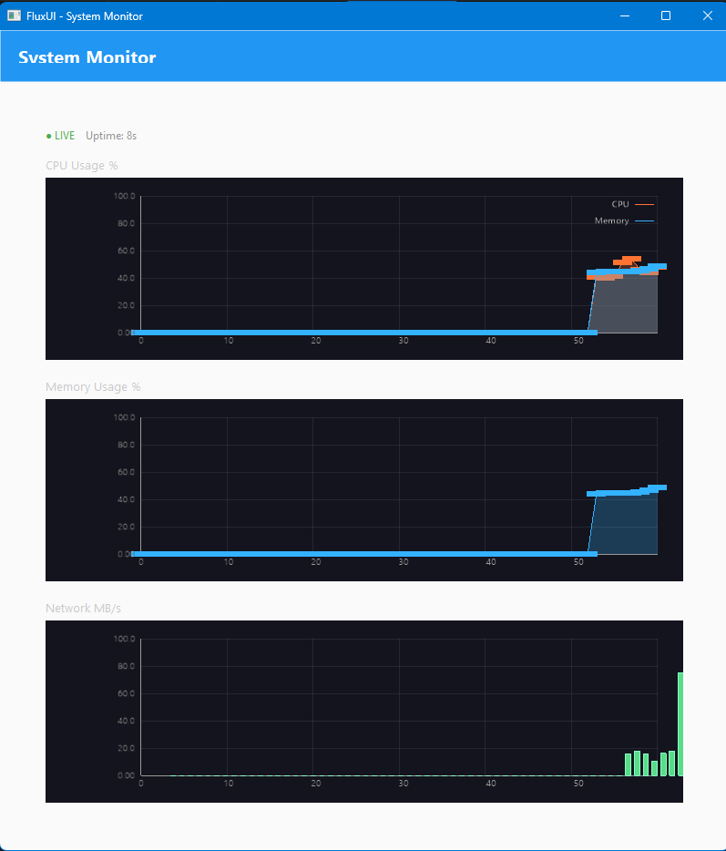
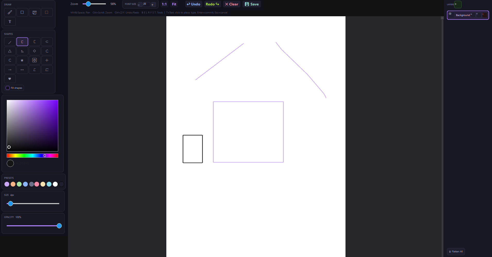
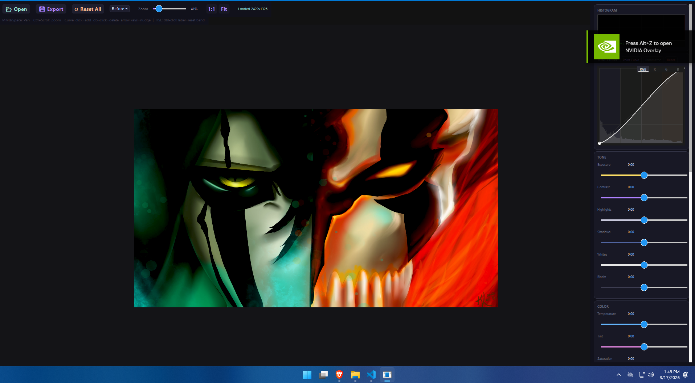
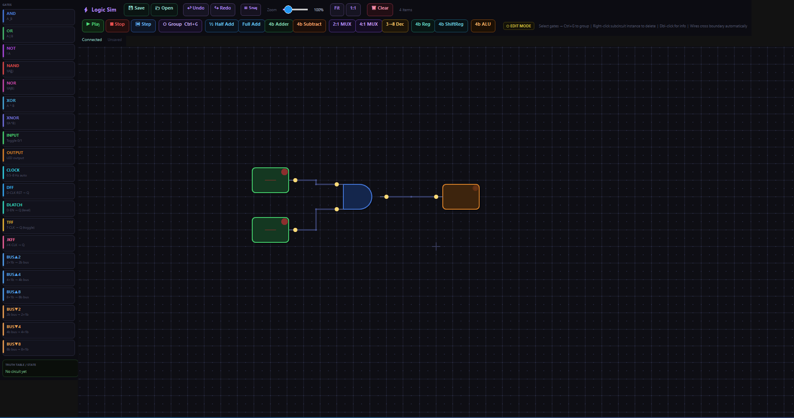
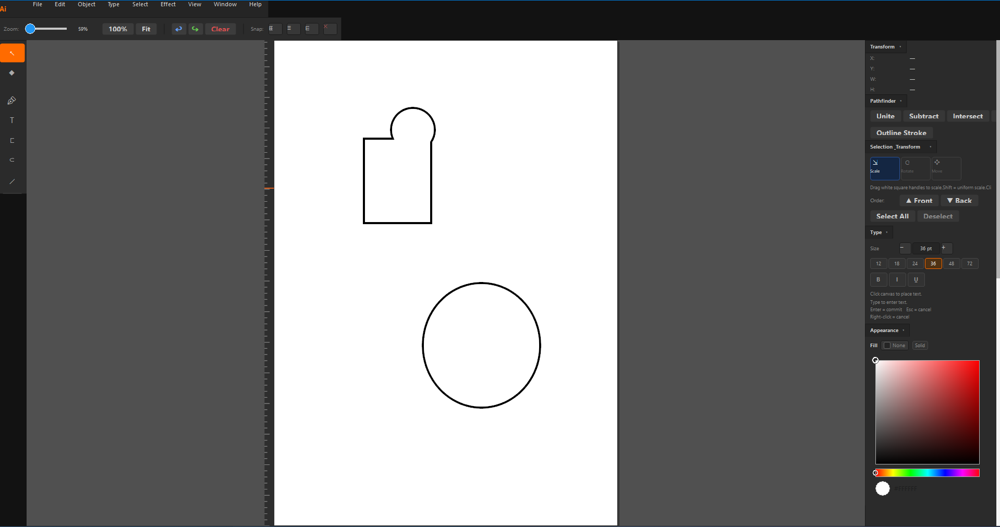

# FluxUI

A declarative, Flutter-inspired widget toolkit for building native Windows UIs in C++.  
Chain methods, compose layouts, bind reactive state — no XAML, no bloat, no WndProc editing.

**Platform:** Windows 10+ · **Compiler:** MSVC 2022 · **Standard:** C++20 · **Renderer:** GDI+ / OpenGL

---

## Quick start

```cmake
include(FetchContent)
FetchContent_Declare(flux
    GIT_REPOSITORY https://github.com/Rosanchaudhary/flux.git
    GIT_TAG        v0.1.0
)
FetchContent_MakeAvailable(flux)
target_link_libraries(my_app PRIVATE flux::flux)
```

```cpp
#include "flux/flux.hpp"

class MyApp : public Component {
  State<int> count;
public:
  MyApp() : count(0, context) {}

  WidgetPtr build() override {
    return Scaffold(
      AppBar("My App"),
      Center(
        Column({
          Text(count, [](int v){ return "Count: " + std::to_string(v); })
              ->setFontSize(28),
          Button("Increment", [this]{ count.set(count.get() + 1); })
        })->setSpacing(16)
      )
    );
  }
};

int WINAPI WinMain(HINSTANCE hInstance, HINSTANCE, LPSTR, int) {
  FluxUI app(hInstance);
  app.build([&]{ return FluxApp("My App", BuildComponent<MyApp>(), AppTheme::light()); });
  app.createWindow("My App", 900, 700);
  return app.run();
}
```

---

## Screenshots

<p align="center">
  
  
</p>
<p align="center"><em>Layout system · Reactive counter</em></p>

<p align="center">
  
  
</p>
<p align="center"><em>Graph widget · Paint canvas</em></p>

<p align="center">
  
  
</p>
<p align="center"><em>Photo editor · Logic simulator</em></p>

<p align="center">
  
</p>
<p align="center"><em>Illustrator-style app</em></p>

## Table of Contents

- [Components](#components)
- [Display](#display)
- [Interaction](#interaction)
- [Input](#input)
- [Collection](#collection)
- [Canvas](#canvas)
- [State](#state)
- [Layout](#layout)
- [Structure](#structure)
- [Overlay](#overlay)
- [Navigation](#navigation)
- [Data](#data)

---

## Components

### Component

Base class for stateful UI logic. Override `build()` to return your widget tree.

```cpp
class MyComponent : public Component {
  State<int> count;
public:
  MyComponent() : count(0, context) {}

  WidgetPtr build() override {
    return Column({
      Text(count)->setFontSize(32),
      Button("Increment", [this]{ count.set(count.get() + 1); })
    })->setSpacing(10);
  }
};
```

| Method | Description |
|---|---|
| `build()` | Returns the widget tree. Called **once** at startup — never again on state change |
| `initState()` | Optional setup hook, called once after construction |
| `dispose()` | Optional cleanup hook, called on destruction |

> **Key difference from Flutter:** `build()` is called **once**. State changes flow directly to widgets via the observer system — no rebuild is triggered.

---

### CHILD macro

Instantiates a child component inline inside a parent's `build()`.

```cpp
// No args
CHILD(MyComponent)

// With parent state pointer
CHILD(ChildCounter, &count)

// With multiple args
CHILD(ChildForm, &name, &age, &email)
```

---

### BuildComponent

Alternative to `CHILD` for top-level component instantiation.

```cpp
app.build([&]{
  return FluxApp("My App", BuildComponent<MyComponent>(), AppTheme::light());
});
```

---

### Passing state to children

Parent owns the state and passes a raw pointer to the child.

```cpp
class ParentCounter : public Component {
  State<int> count;
public:
  ParentCounter() : count(0, context) {}

  WidgetPtr build() override {
    return Column({
      Text(count)->setFontSize(32),
      Button("Increment", [this]{ count.set(count.get() + 1); }),
      CHILD(ChildCounter, &count)
    })->setSpacing(10);
  }
};

class ChildCounter : public Component {
  State<int> *count;
  State<int> childCount;
public:
  explicit ChildCounter(State<int> *count)
      : count(count), childCount(0, context) {}

  WidgetPtr build() override {
    return Column({
      Text(deref(count))->setFontSize(32),
      Button("Decrement", [this]{ count->set(count->get() - 1); }),
      Text(childCount)->setFontSize(32),
      Button("Child --", [this]{ childCount.set(childCount.get() - 1); })
    })->setSpacing(10);
  }
};
```

---

### deref helper

Converts a `State<T>*` pointer to `State<T>&` so it works with all widget APIs.

```cpp
Text(deref(count))
TextInput("...")->setInputValue(deref(text))
Slider(0, 100, 1)->setValue(deref(value))
Toggle("...")->setValue(deref(enabled))
```

---

## Display

### Text

Renders a string of text. Auto-sizes to its content by default.

```cpp
Text("Hello, world!")
    ->setFontSize(18)
    ->setFontWeight(FontWeight::Bold)
    ->setTextColor(RGB(30, 30, 30));

// Reactive
Text(myState);
Text(count, [](int v){ return "Count: " + std::to_string(v); });
```

**Factory**

| Signature | Description |
|---|---|
| `Text(string)` | Static text |
| `Text(State<T>)` | Reactive — auto-updates when state changes |
| `Text(State<T>, transform)` | Reactive with a custom format function |

**Methods**

| Method | Type | Description |
|---|---|---|
| `setText(string)` | `string` | Set or change displayed text |
| `setFontSize(size)` | `int` | Font size in points |
| `setFontWeight(weight)` | `FontWeight` | `Normal` or `Bold` |
| `setFontFamily(family)` | `string` | Font family name |
| `setTextColor(color)` | `COLORREF` | Text color |
| `setHoverTextColor(color)` | `COLORREF` | Text color on hover |
| `setPadding(p)` | `int` | Uniform padding |
| `setBackgroundColor(color)` | `COLORREF` | Fill behind text |
| `setBorderRadius(r)` | `int` | Corner rounding for background |
| `setWidth(w)` | `int` | Fixed width |
| `setHeight(h)` | `int` | Fixed height |
| `setMinWidth(w)` | `int` | Minimum width constraint |

---

### Icon

Renders a glyph from an icon font (default: Segoe MDL2 Assets).

```cpp
Icon(L'\uE700')                    // static glyph
Icon(L'\uE700', "Segoe MDL2 Assets", 20)
Icon(state, [](bool v) -> wchar_t { return v ? L'\uE73E' : L'\uE711'; })
```

**Factory**

| Signature | Description |
|---|---|
| `Icon(glyph)` | Static glyph at default size (16px) |
| `Icon(glyph, fontFamily, size)` | Static glyph with explicit font and size |
| `Icon(State<T>, transform)` | Reactive glyph — transform maps T to `wchar_t` |

**Methods**

| Method | Description |
|---|---|
| `setSize(size)` | Icon size in points |
| `setColor(color)` | Icon color |
| `setHoverColor(color)` | Icon color on hover |
| `setIconFontFamily(family)` | Override icon font |

---

### Divider

A 1px horizontal rule that fills available width.

```cpp
Divider()
```

---

### ProgressBar

Horizontal progress indicator with solid or gradient fill.

```cpp
ProgressBar(0.65)
    ->setProgressColors({ RGB(33,150,243), RGB(0,200,150) })
    ->setHeight(8)
    ->setBorderRadius(4);

ProgressBar()->setValue(progressState);
```

**Methods**

| Method | Type | Description |
|---|---|---|
| `setValue(v)` | `double` 0–1 | Static fill level |
| `setValue(State<double>)` | State | Reactive fill level |
| `setProgressColors(colors)` | `vector<COLORREF>` | Solid or gradient fill |
| `setBackgroundColor(color)` | `COLORREF` | Track background |
| `setBorderColor(color)` | `COLORREF` | Track border |
| `setBorderWidth(w)` | `int` | Border thickness |
| `setBorderRadius(r)` | `int` | Corner rounding |
| `setHeight(h)` | `int` | Bar height (default 12px) |
| `setWidth(w)` | `int` | Fixed width |

---

### Graph

OpenGL-rendered chart widget supporting Line, Bar, and Area types.

```cpp
Graph(500, 300)
    ->addSeries("Temperature", {22,24,27,23,19}, 1.0f, 0.4f, 0.2f)
    ->setTitle("Daily Temps")
    ->setXLabels({"Mon","Tue","Wed","Thu","Fri"});

// Reactive
Graph(600, 300)
    ->addSeries("CPU", cpuDataState, 0.0f, 1.0f, 0.4f)
    ->setType(GraphType::Area);
```

**Factory**

| Signature | Description |
|---|---|
| `Graph()` | Default 400×300 graph |
| `Graph(w, h)` | Fixed-size graph |

**Methods**

| Method | Type | Description |
|---|---|---|
| `addSeries(label, values, r, g, b)` | `string`, `vector<float>` | Add static data series |
| `addSeries(label, State<...>, r,g,b)` | State | Reactive series |
| `bindSeries(idx, State)` | `int`, State | Retrofit reactive binding |
| `setType(type)` | `GraphType` | `Line` · `Bar` · `Area` |
| `setTitle(t)` | `string` | Chart title |
| `setXLabels(labels)` | `vector<string>` | X-axis tick labels |
| `setYRange(min, max)` | `float, float` | Manual Y-axis range |
| `setShowGrid(v)` | `bool` | Toggle grid lines |
| `clearSeries()` | — | Remove all series |
| `setSize(w, h)` | `int, int` | Resize the widget |

---

### Image

Renders an image file via GDI+ with five fit modes.

```cpp
Image("photo.jpg")
    ->setWidth(300)
    ->setHeight(200)
    ->setFit(ImageFit::Cover);

// Circle avatar
Image("avatar.png")->setWidth(64)->setHeight(64)->setBorderRadius(32);
```

**ImageFit modes**

| Value | Description |
|---|---|
| `ImageFit::Fill` | Stretch to fill — may distort |
| `ImageFit::Contain` | Fit inside bounds, letterbox (default) |
| `ImageFit::Cover` | Fill bounds, crop edges |
| `ImageFit::None` | Original size, centered |
| `ImageFit::ScaleDown` | Like None but scales down if larger than container |

**Methods**

| Method | Type | Description |
|---|---|---|
| `setImagePath(path)` | `string` | Load or swap image at runtime |
| `setFit(mode)` | `ImageFit` | Sizing/cropping mode |
| `setWidth(w)` | `int` | Fixed width |
| `setHeight(h)` | `int` | Fixed height |
| `setBorderRadius(r)` | `int` | Corner rounding |
| `setPadding(p)` | `int` | Inner padding |
| `setPlaceholderColor(c)` | `COLORREF` | Fill before image loads |
| `setErrorColor(c)` | `COLORREF` | Fill on load error |

---

## Interaction

### Button

Clickable widget with a background. Accepts a text label or a child widget.

```cpp
Button("Save", [&]{ save(); })
    ->setBackgroundColor(RGB(76,175,80))
    ->setBorderRadius(6)
    ->setPadding(12);

// Widget child
Button(Row({Icon(L'\uE74E'), Text("Upload")}), [&]{ upload(); });
```

**Factory**

| Signature | Description |
|---|---|
| `Button(text, onClick)` | Text label button |
| `Button(child, onClick)` | Widget child button |

**Methods**

| Method | Type | Description |
|---|---|---|
| `setOnClick(handler)` | `ClickHandler` | Click callback |
| `setChild(widget)` | `WidgetPtr` | Replace content widget |
| `setBackgroundColor(color)` | `COLORREF` | Button background |
| `setHoverBackgroundColor(color)` | `COLORREF` | Background on hover |
| `setTextColor(color)` | `COLORREF` | Label text color |
| `setBorderRadius(r)` | `int` | Corner rounding |
| `setPadding(p)` | `int` | Uniform padding |
| `setPaddingAll(l, t, r, b)` | `int ×4` | Per-side padding |
| `setWidth(w)` | `int` | Fixed width |
| `setHeight(h)` | `int` | Fixed height |

---

### GestureDetector

Wraps any widget and attaches pointer/gesture callbacks.

```cpp
GestureDetector(Card(Text("Click me")))
    ->setOnTap([&]{ handleTap(); })
    ->setOnDoubleTap([&]{ handleDouble(); })
    ->setOnLongPress([&]{ showMenu(); })
    ->setOnDragUpdate([&](int dx, int dy){ pan(dx, dy); })
    ->setOnScrollUp([&](int delta){ zoom(delta); });

// Shorthand drag
GestureDetector(myWidget, [&](int dx, int dy){ pan(dx, dy); });
```

> Long press fires after 500ms. Double-tap window is 300ms. Drag starts after 5px of movement.

**Factory**

| Signature | Description |
|---|---|
| `GestureDetector(child)` | Wraps child with no initial callbacks |
| `GestureDetector(child, onDrag)` | Shorthand with drag handler |

**Callbacks**

| Method | Signature | Description |
|---|---|---|
| `setOnTap` | `void()` | Single click |
| `setOnDoubleTap` | `void()` | Two taps within 300ms |
| `setOnLongPress` | `void()` | Press held 500ms |
| `setOnSecondaryTap` | `void()` | Right-click |
| `setOnHoverEnter` | `void()` | Cursor enters bounds |
| `setOnHoverExit` | `void()` | Cursor leaves bounds |
| `setOnPointerMove` | `void(x, y)` | Mouse position while inside |
| `setOnDragStart` | `void()` | Drag threshold exceeded |
| `setOnDragUpdate` | `void(dx, dy)` | Delta since last move |
| `setOnDragEnd` | `void()` | Mouse released after drag |
| `setOnScrollUp` | `void(delta)` | Wheel scrolled up |
| `setOnScrollDown` | `void(delta)` | Wheel scrolled down |

---

## Input

### TextInput

Single-line text field with cursor, scroll, placeholder, and two-way `State<string>` binding.

```cpp
TextInput("Enter your name...")
    ->setInputValue(nameState)
    ->setWidth(320);
```

| Method | Type | Description |
|---|---|---|
| `setInputValue(State<string>)` | State | Two-way reactive binding |
| `setPlaceholder(text)` | `string` | Hint shown when empty |
| `setWidth(w)` | `int` | Fixed width |

---

### Slider

Horizontal range input with draggable thumb and keyboard support.

```cpp
Slider(0.0, 100.0, 1.0)
    ->setValue(volumeState)
    ->setTrackFillColor(RGB(99,102,241))
    ->setOnValueChanged([&](double v){ setVolume(v); });
```

**Factory:** `Slider(min, max, step)`

**Methods**

| Method | Type | Description |
|---|---|---|
| `setValue(State<double>)` | State | Two-way double binding |
| `setValue(State<int>)` | State | Two-way int binding |
| `setMinValue(v)` | `double` | Range minimum |
| `setMaxValue(v)` | `double` | Range maximum |
| `setStep(v)` | `double` | Snap step size |
| `setTrackColor(c)` | `COLORREF` | Unfilled track color |
| `setTrackFillColor(c)` | `COLORREF` | Filled track color |
| `setThumbColor(c)` | `COLORREF` | Thumb color |
| `setOnValueChanged(fn)` | `void(double)` | Change callback |
| `setWidth(w)` | `int` | Fixed width |

---

### Toggle

On/off switch with animated thumb and optional label. Binds to `State<bool>`.

```cpp
Toggle("Dark mode")
    ->setValue(darkModeState)
    ->setTrackOnColor(RGB(99,102,241))
    ->setOnToggleChanged([&](bool v){ applyTheme(v); });
```

| Method | Type | Description |
|---|---|---|
| `setValue(State<bool>)` | State | Two-way binding |
| `setToggled(bool)` | `bool` | Set initial state |
| `setLabel(text)` | `string` | Text beside the toggle |
| `setTrackOnColor(c)` | `COLORREF` | Track color when on |
| `setTrackOffColor(c)` | `COLORREF` | Track color when off |
| `setThumbColor(c)` | `COLORREF` | Thumb color |
| `setOnToggleChanged(fn)` | `void(bool)` | Change callback |

---

### CheckBox

Standard checkbox with optional label. Binds to `State<bool>`.

```cpp
CheckBox("I agree to the terms")->setInputValue(agreedState);
```

| Signature | Description |
|---|---|
| `CheckBox(label)` | Checkbox with optional text label |
| `setInputValue(State<bool>)` | Two-way bool binding |

---

### RadioGroup / RadioButton

Mutually-exclusive radio buttons bound to `State<string>`.

```cpp
RadioGroupWithOptions({
    {"free",  "Free tier"},
    {"pro",   "Pro — $9/mo"},
    {"team",  "Team — $29/mo"},
})->bindValue(planState)
  ->setOnSelectionChanged([&](const std::string& v){ changePlan(v); });

// Manual
auto group = RadioGroup();
group->addRadioButton(RadioButton("opt_a", "Option A"));
group->addRadioButton(RadioButton("opt_b", "Option B"));
group->setHorizontal();
```

**RadioGroup methods**

| Method | Description |
|---|---|
| `addRadioButton(RadioButtonPtr)` | Add a button to the group |
| `bindValue(State<string>)` | Two-way selected-value binding |
| `setSelectedValue(string)` | Set selected value imperatively |
| `setOnSelectionChanged(fn)` | Callback with newly selected value |
| `setHorizontal()` / `setVertical()` | Layout direction |
| `getSelectedValue()` | Returns current selection |

---

### ColorPicker

HSV color picker with saturation/value square, hue bar, optional alpha bar, and hex display.

```cpp
ColorPicker(RGB(255, 0, 0))
    ->bindValue(brushColorState)
    ->setShowAlpha(false)
    ->setOnColorChanged([&](COLORREF c){ applyColor(c); });
```

**Factory:** `ColorPicker(initialColor)`

**Methods**

| Method | Type | Description |
|---|---|---|
| `setColor(color)` | `COLORREF` | Set color imperatively |
| `getColor()` | `COLORREF` | Read current color |
| `setShowAlpha(show)` | `bool` | Show/hide alpha bar (default `true`) |
| `setOnColorChanged(fn)` | `void(COLORREF)` | Fired on every color change |
| `bindValue(State<COLORREF>)` | State | Two-way reactive binding |

---

### DatePicker

Calendar popup for selecting a date. Includes month/year navigation and a year-range picker.

```cpp
#include "flux_date_picker.hpp"

DatePicker()
    ->setDate(FluxDate::today())
    ->setPlaceholder("Select a date")
    ->setOnDateChanged([](FluxDate d) {
        std::cout << d.toString("%d %b %Y") << std::endl;
    });

// Reactive binding
State<FluxDate> selectedDate(FluxDate{}, app);
DatePicker()->setDate(selectedDate);
```

**FluxDate struct**

```cpp
FluxDate d = FluxDate::today();   // today
FluxDate d{2025, 6, 15};         // June 15, 2025
d.toString("%d / %m / %Y");       // "15 / 06 / 2025"
d.isValid();                      // true if year/month/day are set
```

**Methods**

| Method | Type | Description |
|---|---|---|
| `setDate(FluxDate)` | `FluxDate` | Set initial date |
| `setDate(State<FluxDate>)` | State | Two-way reactive binding |
| `setPlaceholder(text)` | `string` | Text when no date selected |
| `setDateFormat(fmt)` | `string` | `strftime`-style format string |
| `setMinDate(date)` | `FluxDate` | Disable dates before this |
| `setMaxDate(date)` | `FluxDate` | Disable dates after this |
| `setOnDateChanged(fn)` | `void(FluxDate)` | Fires when a date is picked |
| `setAccentColor(color)` | `COLORREF` | Header, selection, and indicator color |
| `setWidth(w)` | `int` | Fixed width |

> **Navigation:** Click month/year header to open year picker. `◀ ▶` arrows navigate months or year ranges.

---

## Collection

### ListView

Scrollable list. Static initializer-list form or reactive `State<vector<T>>` builder form.

```cpp
// Static
ListView({
    Card(Text("Item A")),
    Card(Text("Item B")),
})->setSpacing(8);

// Reactive builder
ListView(contactsState)
    ->itemBuilder([](int i, const Contact& c) -> WidgetPtr {
        return Card(Text(c.name));
    })
    ->separator([]{ return Divider(); })
    ->setSpacing(8);
```

**Factory**

| Signature | Description |
|---|---|
| `ListView({item, item, ...})` | Static list |
| `ListView(State<vector<T>>)` | Reactive list |

**Methods (both modes)**

| Method | Description |
|---|---|
| `setSpacing(px)` | Gap between items |
| `setHorizontal(bool)` | Switch to horizontal scroll |
| `setScrollbarSize(px)` | Scrollbar thickness |
| `setScrollbarColor(c)` | Idle thumb color |
| `setScrollbarHoverColor(c)` | Hover thumb color |
| `setScrollbarActiveColor(c)` | Drag thumb color |
| `setScrollbarTrackColor(c)` | Track background |
| `setPadding(px)` | Inner padding (static mode) |
| `setBackgroundColor(c)` | Background fill (static mode) |
| `setHeight(h)` | Fixed height (static mode) |

**Methods (reactive builder only)**

| Method | Description |
|---|---|
| `itemBuilder(fn)` | Builder `(int index, const T&) -> WidgetPtr` |
| `separator(fn)` | Widget inserted between items |
| `setKeyFn(fn)` | Custom key function for diffing |

---

### GridView

Scrollable grid driven by `State<vector<T>>`.

```cpp
GridView(photosState)
    ->columns(3)
    ->itemBuilder([](int i, const Photo& p) -> WidgetPtr {
        return Thumbnail(p);
    })
    ->setSpacing(12);

// Responsive
GridView(itemsState)->columnWidth(200)->itemBuilder(...);
```

| Method | Description |
|---|---|
| `itemBuilder(fn)` | Builder `(int index, const T&) -> WidgetPtr` |
| `columns(n)` | Fixed column count |
| `columnWidth(px)` | Responsive — derive column count from width |
| `setSpacing(px)` | Set H and V spacing |
| `setSpacingH(px)` | Horizontal gap |
| `setSpacingV(px)` | Vertical gap |
| `setScrollbarWidth(px)` | Scrollbar thickness |
| `setScrollbarColor(c)` | Idle thumb color |
| `setScrollbarHoverColor(c)` | Hover thumb color |
| `setScrollbarActiveColor(c)` | Drag thumb color |
| `setScrollbarTrackColor(c)` | Track background |
| `setKeyFn(fn)` | Custom key function for diffing |

---

### Grid

Static fixed-column grid for a known set of children. Non-scrolling.

```cpp
Grid(3,
    Card(Text("A")),
    Card(Text("B")),
    Card(Text("C"))
)->setSpacing(16);

GridFixedWidth(200, items...);
GridFromList(4, widgetVector);
```

**Factory**

| Signature | Description |
|---|---|
| `Grid(columns, widgets...)` | Fixed columns, variadic children |
| `GridFixedWidth(cellWidth, widgets...)` | Responsive from variadic children |
| `GridFromList(columns, vector)` | Fixed columns from runtime vector |
| `GridFixedWidthFromList(cellWidth, vector)` | Responsive from runtime vector |

**Methods**

| Method | Description |
|---|---|
| `setColumnCount(n)` | Fixed column count |
| `setColumnWidth(px)` | Responsive mode |
| `setSpacing(px)` | Uniform gap |
| `setSpacingH(px)` / `setSpacingV(px)` | Per-axis gap |
| `setCrossAxisAlignment(a)` | `Start · Center · End · Stretch` |
| `setMainAxisAlignment(a)` | `Start · Center · End` |
| `setPadding(px)` | Uniform padding |
| `setPaddingAll(l, t, r, b)` | Per-side padding |
| `setBackgroundColor(c)` | Grid background |
| `setWidth(w)` / `setHeight(h)` | Fixed dimensions |
| `setFlex(n)` | Flex factor in parent |

---

### TreeView

Scrollable hierarchical tree with expand/collapse, single selection, keyboard navigation, and optional indent guide lines.

```cpp
#include "flux_tree_view.hpp"

TreeNode root("Project");
auto &src = root.addChild(TreeNode("src"));
src.expanded = true;
src.addChild(TreeNode("main.cpp"));
auto &comp = src.addChild(TreeNode("components"));
comp.addChild(TreeNode("flux_widget.hpp"));

auto tv = TreeView(root)
    ->setOnSelectionChanged([](const TreeNode *n) {
        std::cout << n->label << std::endl;
    })
    ->setShowGuideLines(true)
    ->setFlex(1);

// Multiple roots
auto tv = TreeView({rootA, rootB, rootC});
```

**TreeNode struct**

```cpp
TreeNode node("label", "optional-id");
node.expanded  = true;      // start expanded
node.disabled  = false;     // grayed out, not selectable
node.icon      = L"\uE8B7"; // Segoe MDL2 glyph (optional)
node.userData  = &myObj;    // attach any pointer

node.addChild(TreeNode("child"));
node.expandAll();
node.collapseAll();
node.isLeaf();   // true if no children
```

**Methods**

| Method | Type | Description |
|---|---|---|
| `setOnSelectionChanged(fn)` | `void(const TreeNode*)` | Fires on click |
| `setOnNodeExpanded(fn)` | `void(const TreeNode*)` | Fires on expand |
| `setOnNodeCollapsed(fn)` | `void(const TreeNode*)` | Fires on collapse |
| `setOnNodeDoubleClicked(fn)` | `void(const TreeNode*)` | Fires on double-click |
| `setRoots(vector<TreeNode>)` | — | Replace the entire tree at runtime |
| `selectById(id)` | `string` | Select a node by its id field |
| `expandAll()` / `collapseAll()` | — | Expand or collapse all nodes |
| `selectedNode()` | `const TreeNode*` | Currently selected node |
| `setRowHeight(h)` | `int` | Row height in pixels (default 28) |
| `setIndentWidth(w)` | `int` | Pixels per depth level (default 20) |
| `setShowGuideLines(v)` | `bool` | Vertical indent guide lines |
| `setFontSize(s)` | `int` | Label font size |
| `setAccentColor(c)` | `COLORREF` | Selection highlight color |
| `setFlex(n)` | `int` | Flex factor in parent |

> **Keyboard:** `↑/↓` move selection · `←` collapse or jump to parent · `→` expand or move to first child · `Home/End` jump to first/last · `Enter/Space` toggle expand.

---

### DataTable

Virtualised sortable data grid with resizable columns, alternating rows, horizontal/vertical scrollbars, and optional reactive data binding.

```cpp
#include "flux_data_table.hpp"

std::vector<DataColumn> columns = {
    DataColumn("name",   "Name",   180),
    DataColumn("role",   "Role",   130),
    DataColumn("age",    "Age",     60).setAlign(ColumnAlign::Right),
    DataColumn("salary", "Salary", 110).setAlign(ColumnAlign::Right)
        .setFormatter([](const std::string &v){ return "$" + v + "k"; }),
};

std::vector<DataRow> rows = {
    DataRow("1").set("name","Alice").set("role","Engineer").set("age","29").set("salary","120"),
    DataRow("2").set("name","Bob")  .set("role","Designer").set("age","34").set("salary","95"),
};

auto table = DataTable(columns, rows)
    ->setAlternateRows(true)
    ->setOnRowSelected([](int idx, const DataRow &row) {
        std::cout << row.get("name") << std::endl;
    });

// Reactive rows
State<std::vector<DataRow>> rowsState(..., app);
auto table = DataTable(columns, rowsState);
```

**DataColumn**

```cpp
DataColumn col("key", "Label", 120);
col.setAlign(ColumnAlign::Right);   // Left · Center · Right
col.setSortable(false);
col.setResizable(false);
col.setMinWidth(40);
col.setFormatter([](const std::string &v){ return "$" + v; });
```

**DataRow**

```cpp
DataRow row("optional-id");
row.set("name", "Alice").set("age", "29");  // fluent chain
row.get("name");                             // "Alice"
row.disabled = true;                         // grayed out, not selectable
```

**Methods**

| Method | Type | Description |
|---|---|---|
| `setRows(vector<DataRow>)` | — | Replace rows at runtime |
| `sortBy(key, ascending)` | `string, bool` | Sort programmatically |
| `clearSort()` | — | Remove sort, restore insertion order |
| `selectedIndex()` | `int` | Currently selected visual row index |
| `selectedRow()` | `const DataRow*` | Currently selected row data |
| `setAlternateRows(v)` | `bool` | Alternating row background (default true) |
| `setShowColumnDividers(v)` | `bool` | Vertical column divider lines |
| `setRowHeight(h)` | `int` | Row height in pixels (default 30) |
| `setHeaderHeight(h)` | `int` | Header row height (default 36) |
| `setHeaderBackground(c)` | `COLORREF` | Header background color |
| `setAccentColor(c)` | `COLORREF` | Selection highlight and sort arrow color |
| `setOnRowSelected(fn)` | `void(int, DataRow)` | Fires on single click |
| `setOnRowDoubleClicked(fn)` | `void(int, DataRow)` | Fires on double-click |
| `setOnSortChanged(fn)` | `void(string, bool)` | Fires when sort column changes |
| `setFlex(n)` | `int` | Flex factor in parent |
| `setWidth(w)` / `setHeight(h)` | `int` | Fixed dimensions |

> **Sorting:** Click a column header to sort ascending; click again to reverse. Numeric strings sort numerically. **Column resize:** drag the 4px zone at each column edge. **Keyboard:** `↑/↓` navigate rows · `Home/End` jump · `PgUp/PgDn` page.

---

## Canvas

### CanvasWidget

OpenGL-powered drawing surface embedded in the widget tree. Manages its own GL context, pan/zoom viewport, and scrollbars.

```cpp
// Raster canvas — same view and canvas size
auto canvas = RasterCanvas(800, 600);

// With pan/zoom viewport
auto canvas = RasterCanvas(800, 600, 2048, 2048);

// Custom undo budget
auto canvas = RasterCanvas(800, 600, 64ULL * 1024 * 1024);

canvas->onViewportChanged = [&](float zoom){ updateZoomLabel(zoom); };
```

**Factory**

| Signature | Description |
|---|---|
| `Canvas()` | Bare canvas, 400×300, no surface |
| `Canvas(w, h)` | Bare canvas at given size |
| `RasterCanvas(w, h)` | Canvas + RasterSurface, viewport disabled |
| `RasterCanvas(w, h, undoBudget)` | As above with custom undo memory in bytes |
| `RasterCanvas(viewW, viewH, canvasW, canvasH)` | Canvas + RasterSurface, viewport enabled |

**Methods**

| Method | Type | Description |
|---|---|---|
| `setSize(w, h)` | `int, int` | View (widget) dimensions |
| `setCanvasSize(w, h)` | `int, int` | Drawing surface dimensions |
| `setViewportEnabled(bool)` | `bool` | Enable/disable pan/zoom |
| `setScrollbarsEnabled(bool)` | `bool` | Show/hide scrollbars |
| `setSurface<T>(args...)` | Template | Attach a `RenderSurface` subclass |
| `getSurface()` | `RenderSurface*` | Access active surface |
| `viewport()` | `Viewport&` | Access viewport for zoom/pan control |
| `redraw()` | — | Schedule a repaint |
| `onViewportChanged` | `function<void(float)>` | Fires when zoom or pan changes |
| `onGLResize` | `function<void(int, int)>` | Fires when GL surface is resized |

> **Navigation:** Middle-mouse or `Space + Left-drag` to pan. `Ctrl + Scroll` to zoom. `Ctrl++/-/0` for keyboard zoom.

---

### RasterSurface

GDI+-backed OpenGL raster painting surface with brush engine and undo/redo.

```cpp
auto surface = canvas->setSurface<RasterSurface>();

surface->setTool(kToolBrush);
StrokeStyle style;
style.r = 0.2f; style.g = 0.4f; style.b = 1.0f;
style.radius = 8.f; style.hardness = 0.9f; style.opacity = 0.8f;
surface->setStrokeStyle(style);

surface->undo();
surface->savePNG(L"output.png");
```

**Tool IDs**

| Constant | Description |
|---|---|
| `kToolBrush` | Paints onto scratch FBO, merges on mouse up |
| `kToolEraser` | Paints white directly onto committed FBO |

**Methods**

| Method | Type | Description |
|---|---|---|
| `setTool(id)` | `ToolId` | Switch active tool |
| `setStrokeStyle(style)` | `StrokeStyle` | Set color, radius, hardness, opacity |
| `getStrokeStyle()` | `const StrokeStyle&` | Current stroke style |
| `setOpacity(op)` | `float` 0–1 | Stroke opacity shortcut |
| `undo()` / `redo()` | — | Undo/redo last stroke |
| `canUndo()` / `canRedo()` | `bool` | History availability |
| `clear()` | — | Push undo snapshot then fill white |
| `savePNG(path)` | `wstring` | Export committed layer to PNG |
| `colorHistory()` | `const vector<RGBA>&` | Recently used colors (up to 16) |

> **Keyboard:** `Ctrl+Z` undo, `Ctrl+Shift+Z` / `Ctrl+Y` redo.

---

### Viewport

Controls zoom and pan. Accessible via `canvas->viewport()`.

```cpp
auto& vp = canvas->viewport();
vp.zoomIn(); vp.fitToView(); vp.resetZoom();
auto [cx, cy] = vp.screenToCanvas(screenX, screenY);
```

**Methods**

| Method | Description |
|---|---|
| `zoomIn()` | Zoom in 1.25× toward view center |
| `zoomOut()` | Zoom out 0.8× toward view center |
| `zoomToward(sx, sy, factor)` | Zoom toward a screen-space point |
| `resetZoom()` | Set zoom = 1 and center canvas |
| `fitToView()` | Scale and center to fit canvas in viewport |
| `panByScreen(dx, dy)` | Pan by screen-space pixel deltas |
| `setOffset(cx, cy)` | Set canvas-space pan offset |
| `screenToCanvas(sx, sy)` | Convert screen coords to canvas coords |
| `zoom()` | Current zoom factor |
| `offsetX()` / `offsetY()` | Current pan offset |

---

## State

### Conditional

Ternary-style conditional rendering. Rebuilds its child when the observed state's predicate changes.

```cpp
// Bool state
Conditional(isLoggedIn)
    ->Then([]{ return Dashboard(); })
    ->Else([]{ return LoginPage(); });

// Custom predicate on any State<T>
Conditional(itemCount, [](int v){ return v > 0; })
    ->Then([]{ return ItemList(); })
    ->Else([]{ return EmptyState(); });
```

| Method | Description |
|---|---|
| `Then(builder)` | Widget when condition is true |
| `Else(builder)` | Widget when condition is false |

---

### Switch

C++-style switch-case conditional rendering.

```cpp
Switch(tabIndex)
    ->Case(0, []{ return HomePage(); })
    ->Case(1, []{ return ProfilePage(); })
    ->Case(2, []{ return SettingsPage(); })
    ->Default([]{ return ErrorPage(); });
```

| Method | Description |
|---|---|
| `Case(value, builder)` | Widget when state equals value |
| `Default(builder)` | Fallback when no case matches |

---

## Layout

### Row

Lays children out horizontally with flex expansion support.

```cpp
Row({
    Text("Label"),
    Expanded(TextInput()),
    Button("Send")
})->setSpacing(8)->setCrossAxisAlignment(CrossAxisAlignment::Center);
```

| Method | Type | Description |
|---|---|---|
| `setSpacing(px)` | `int` | Gap between children |
| `setCrossAxisAlignment(a)` | `CrossAxisAlignment` | Vertical alignment |
| `setMainAxisAlignment(a)` | `MainAxisAlignment` | Horizontal distribution |
| `setWidth(w)` | `int` | Fixed width |
| `setHeight(h)` | `int` | Fixed height |
| `setPadding(p)` | `int` | Uniform padding |
| `setBackgroundColor(c)` | `COLORREF` | Row background |
| `setFlex(n)` | `int` | Flex factor in parent |

---

### Column

Lays children out vertically with flex expansion support.

```cpp
Column({
    AppBar("Title"),
    Expanded(ListView(itemsState)->itemBuilder(...)),
})->setSpacing(0);
```

| Method | Type | Description |
|---|---|---|
| `setSpacing(px)` | `int` | Gap between children |
| `setCrossAxisAlignment(a)` | `CrossAxisAlignment` | Horizontal alignment |
| `setMainAxisAlignment(a)` | `MainAxisAlignment` | Vertical distribution |
| `setWidth(w)` | `int` | Fixed width |
| `setHeight(h)` | `int` | Fixed height |
| `setPadding(p)` | `int` | Uniform padding |
| `setBackgroundColor(c)` | `COLORREF` | Column background |
| `setBorderRadius(r)` | `int` | Corner rounding |
| `setMinWidth(w)` | `int` | Minimum width |
| `setFlex(n)` | `int` | Flex factor in parent |

---

### Stack

Layers children on top of each other. Supports absolute positioning via margins.

```cpp
Stack(
    Image("bg.jpg")->setWidth(400)->setHeight(300),
    Positioned(Text("Overlay"), 10, 10)
)->setExpand(true);
```

**Factory:** `Stack(widgets...)` or `Stack({widget, widget, ...})`

**Positioned helper**

```cpp
// Absolute position by pixel offset
Positioned(child, left, top, right, bottom)

// Reactive — single state, separate x/y transforms
Positioned(child, state, xTransform, yTransform)

// Reactive — two independent states
Positioned(child, xState, xTransform, yState, yTransform)
```

**StackWidget methods**

| Method | Description |
|---|---|
| `setAlignment(a)` | Default alignment for unpositioned children |
| `setExpand(bool)` | Fill available space instead of shrink-wrapping |
| `setWidth(w)` / `setHeight(h)` | Fixed dimensions |
| `setPadding(p)` | Uniform padding |
| `setBackgroundColor(c)` | Background fill |
| `setBorderRadius(r)` | Corner rounding |
| `setFlex(n)` | Flex factor in parent |

---

### Container

Single-child box with full styling — background, border, radius, padding, margin, size constraints, hover effects.

```cpp
Container(Text("Hello"))
    ->setBackgroundColor(RGB(240,248,255))
    ->setBorderColor(RGB(33,150,243))
    ->setBorderWidth(1)
    ->setBorderRadius(8)
    ->setPadding(16)
    ->setHoverBackgroundColor(RGB(220,240,255));

// Reactive background
Container(child)->setBackgroundColor(selectedState,
    [](bool v){ return v ? RGB(230,245,255) : RGB(255,255,255); });

// Reactive visibility
Container(child)->setVisible(visibleState, [](bool v){ return v; });
```

| Method | Type | Description |
|---|---|---|
| `setBackgroundColor(color)` | `COLORREF` | Fill color |
| `setBackgroundColor(State, transform)` | State | Reactive background |
| `setHoverBackgroundColor(color)` | `COLORREF` | Fill on hover |
| `setBorderColor(color)` | `COLORREF` | Border stroke |
| `setHoverBorderColor(color)` | `COLORREF` | Border on hover |
| `setBorderWidth(w)` | `int` or State | Border thickness |
| `setBorderRadius(r)` | `int` or State | Corner rounding |
| `setPadding(p)` | `int` | Uniform inner padding |
| `setPaddingAll(l,t,r,b)` | `int ×4` | Per-side inner padding |
| `setMargin(m)` | `int` | Uniform outer margin |
| `setMarginAll(l,t,r,b)` | `int ×4` | Per-side outer margin |
| `setWidth(w)` | `int` or State | Fixed width |
| `setHeight(h)` | `int` or State | Fixed height |
| `setMinWidth(w)` | `int` | Minimum width |
| `setMinHeight(h)` | `int` | Minimum height |
| `setMaxWidth(w)` | `int` | Maximum width |
| `setMaxHeight(h)` | `int` | Maximum height |
| `setFlex(n)` | `int` | Flex factor |
| `setOnHover(fn)` | `void(bool)` | Hover enter/leave callback |
| `setBackgroundAlpha(a)` | `BYTE` | Background opacity (0–255) |
| `setBorderAlpha(a)` | `BYTE` | Border opacity (0–255) |
| `setVisible(v)` | `bool` or State | Show/hide |

---

### Center

Centers its single child both horizontally and vertically.

```cpp
Center(Text("No items found")->setTextColor(RGB(150,150,150)));
```

---

### Expanded

Causes its child to fill remaining space along the parent Row or Column's main axis.

```cpp
Row({
    Text("Label"),
    Expanded(TextInput()),   // takes all remaining width
    Button("Go")
});

// Proportional — 2:1 split
Row({
    Expanded(Column(...), 2),
    Expanded(Column(...), 1)
});
```

**Factory:** `Expanded(child, flex = 1)`

---

### SizedBox

Fixed-size box. Used as a spacer or to constrain a child to an exact size.

```cpp
SizedBox(0, 24);                        // 24px vertical gap
SizedBox(16, 0);                        // 16px horizontal gap
SizedBox(200, 48, Button("Submit"));    // constrained child
```

---

### Padding

Uniform padding wrapper. Shorthand for `Container` with a single padding value.

```cpp
Padding(16, Text("Padded content"));
```

---

### SplitView

Two-pane resizable container with a draggable divider. Supports horizontal (left/right) and vertical (top/bottom) splits.

```cpp
#include "flux_split_view.hpp"

// Horizontal split — left pane gets 30%
SplitView(leftWidget, rightWidget, 0.3f)
    ->setMinPaneWidth(120)
    ->setDividerColor(RGB(210, 210, 210))
    ->setDividerHoverColor(RGB(33, 150, 243));

// Vertical split
SplitViewVertical(topWidget, bottomWidget, 0.4f);

// Reactive ratio
State<float> ratio(0.5f, app);
SplitView(left, right)->setRatio(ratio);
```

**Methods**

| Method | Type | Description |
|---|---|---|
| `setRatio(r)` | `float` 0–1 | Fraction of space given to pane 0 |
| `setRatio(State<float>)` | State | Reactive ratio binding |
| `setMinPaneWidth(px)` | `int` | Minimum size of either pane |
| `setDividerWidth(px)` | `int` | Divider thickness (default 6px) |
| `setDividerColor(c)` | `COLORREF` | Default divider color |
| `setDividerHoverColor(c)` | `COLORREF` | Divider color on hover |
| `setDividerDragColor(c)` | `COLORREF` | Divider color while dragging |
| `setVertical(v)` | `bool` | Switch to top/bottom split |
| `setResizable(v)` | `bool` | Allow drag resize (default true) |
| `setOnRatioChanged(fn)` | `void(float)` | Fires after drag completes |
| `getRatio()` | `float` | Current ratio |
| `swapPanes()` | — | Swap pane 0 and pane 1 |
| `collapsePane(idx)` | `int` | Collapse pane 0 or 1 fully |

> **Cursor:** Changes to `IDC_SIZEWE` / `IDC_SIZENS` on divider hover automatically.

---

## Structure

### Scaffold

Root structure widget. Manages the overlay stack used by Dropdown, Tooltip, Dialog, and ContextMenu.

```cpp
Scaffold(
    AppBar("My App"),
    Column({ Text("Content") })
);
```

> **Overlay zIndex order:** Tooltip = 50, Dropdown = 100, ContextMenu = 150, Dialog = 200.

| Method | Description |
|---|---|
| `addOverlay(widget, renderer, zIndex)` | Register a floating overlay |
| `removeOverlay(widget)` | Unregister a floating overlay |
| `clearOverlays()` | Remove all overlays |
| `hasOverlays()` | Returns true if overlays are active |
| `getTopmostOverlay()` | Returns topmost overlay widget pointer |

---

### AppBar

56px tall header bar with blue background and bold white title.

```cpp
AppBar("Dashboard");
```

---

### Card

White rounded-corner box with light border and 16px padding.

```cpp
Card(
    Column({
        Text("Title")->setFontWeight(FontWeight::Bold),
        Text("Description")
    })->setSpacing(8)
);
```

---

## Navigation

### TabView

Tab bar with swappable content panes. Only the active pane is laid out and rendered — inactive panes have zero cost.

```cpp
#include "flux_tab_view.hpp"

TabView({
    Tab("General",  generalWidget),
    Tab("Display",  displayWidget),
    Tab("Network",  networkWidget),
    Tab("Advanced", advancedWidget),
})
->setOnTabChanged([](int i) { std::cout << "Tab: " << i << std::endl; });

// Reactive active index
State<int> activeTab(0, app);
TabView({...})->setActiveIndex(activeTab);
activeTab.set(2); // switches tab programmatically
```

**Methods**

| Method | Type | Description |
|---|---|---|
| `setActiveIndex(idx)` | `int` | Switch to tab by index |
| `setActiveIndex(State<int>)` | State | Two-way reactive binding |
| `setOnTabChanged(fn)` | `void(int)` | Fires when active tab changes |
| `setTabBarHeight(h)` | `int` | Height of the tab bar (default 40px) |
| `setTabMinWidth(w)` | `int` | Minimum tab button width (default 90px) |
| `setTabFontSize(s)` | `int` | Tab label font size |
| `setIndicatorColor(c)` | `COLORREF` | Active tab underline color |
| `setActiveTabText(c)` | `COLORREF` | Active tab label color |
| `setBarBackground(c)` | `COLORREF` | Tab bar background color |
| `setContentPadding(p)` | `int` | Padding inside the content area |
| `setHasContentBorder(v)` | `bool` | Border around content pane |
| `setAccentColor(c)` | `COLORREF` | Sets indicator, active text, hover together |
| `setTabContent(idx, widget)` | — | Replace a tab's content at runtime |
| `setTabLabel(idx, label)` | — | Rename a tab at runtime |
| `tabCount()` | `int` | Number of tabs |
| `setFlex(n)` | `int` | Flex factor in parent |

> **Keyboard:** `Ctrl+Tab` / `Ctrl+Shift+Tab` cycle through tabs. All other key events forward to the active pane.

---

### MenuBar

Horizontal strip of labeled menus that open pulldown lists on left-click. Supports hot-tracking (mouse slides between open menus) and full keyboard navigation.

```cpp
#include "flux_menu_bar.hpp"

auto menuBar = MenuBar({
    MenuBarItem("File", {
        ContextMenuItem::Action("New",  [&]{ newFile(); }),
        ContextMenuItem::Action("Open", [&]{ openFile(); }),
        ContextMenuItem::Separator(),
        ContextMenuItem::Action("Exit", []{ PostQuitMessage(0); }),
    }),
    MenuBarItem("Edit", {
        ContextMenuItem::Action("Cut",   [&]{ cut(); }),
        ContextMenuItem::Action("Copy",  [&]{ copy(); }),
        ContextMenuItem::Action("Paste", [&]{ paste(); }),
    }),
    MenuBarItem("Help", {
        ContextMenuItem::Action("About", [&]{ showAbout(); }),
    }),
});

// Embed below AppBar
Column({
    AppBar("My App"),
    menuBar,
    Expanded(body),
})->setSpacing(0);
```

**Methods**

| Method | Type | Description |
|---|---|---|
| `setBarHeight(h)` | `int` | Height of the menu bar strip (default 28px) |
| `setBarBackground(c)` | `COLORREF` | Bar background color |
| `setItemHeight(h)` | `int` | Dropdown item row height (default 28px) |
| `setMinMenuWidth(w)` | `int` | Minimum dropdown width (default 160px) |

> **Keyboard:** `←/→` switch between open menus · `↑/↓` navigate items · `Enter/Space` activate · `Escape` close.

---

## Overlay

### Dropdown

Select input that opens a scrollable overlay list.

```cpp
Dropdown({"Nepal", "India", "USA", "UK"})
    ->setPlaceholder("Select a country")
    ->setSelectedValue(countryState)
    ->setOnSelectionChanged([&](int i, const std::string& v){
        handleSelect(v);
    });
```

**Factory:** `Dropdown(options)` or `Dropdown()`

**Methods**

| Method | Type | Description |
|---|---|---|
| `setOptions(opts)` | `vector<string>` | Set or replace options |
| `setPlaceholder(text)` | `string` | Text when nothing selected |
| `setSelectedIndex(State<int>)` | State | Two-way binding by index |
| `setSelectedValue(State<string>)` | State | Two-way binding by value |
| `setOnSelectionChanged(fn)` | `void(int, string)` | Change callback |
| `setItemHeight(h)` | `int` | Row height (default 32px) |
| `setMaxVisibleItems(n)` | `int` | Max rows before scroll (default 6) |
| `setWidth(w)` | `int` | Fixed width |

> **Keyboard:** `↑/↓` navigate, `Enter/Space` open/confirm, `Escape` close, `Home/End` jump.

---

### Tooltip

Shows a floating text bubble on hover.

```cpp
Tooltip(
    Button("Delete", [&]{ deleteItem(); }),
    "Permanently removes the item"
)->setPosition(TooltipPosition::Above)
 ->setTooltipMaxWidth(200);
```

**Factory:** `Tooltip(anchor, text)`

**Methods**

| Method | Type | Description |
|---|---|---|
| `setTooltipText(text)` | `string` | Update tooltip content |
| `setPosition(pos)` | `TooltipPosition` | `Above · Below · Auto` |
| `setTooltipBackground(color)` | `COLORREF` | Bubble background |
| `setTooltipTextColor(color)` | `COLORREF` | Bubble text color |
| `setTooltipFontSize(size)` | `int` | Font size inside bubble |
| `setTooltipMaxWidth(w)` | `int` | Max bubble width (default 240px) |

---

### Dialog

Modal overlay with semi-transparent backdrop and centered content panel.

```cpp
auto dlg = Dialog(
    Column({
        Text("Confirm delete?")->setFontSize(16),
        Row({
            Button("Cancel", [&]{ dlg->close(); }),
            Button("Delete", [&]{ deleteItem(); dlg->close(); })
        })->setSpacing(8)
    })
)->setSize(360, 160)
 ->setCloseOnClickOutside(true);

dlg->open();
```

**Factory:** `Dialog(content)`

**Methods**

| Method | Type | Description |
|---|---|---|
| `open()` | — | Show the dialog |
| `close()` | — | Dismiss the dialog |
| `setContent(widget)` | `WidgetPtr` | Set or replace content |
| `setSize(w, h)` | `int, int` | Panel dimensions (default 400×300) |
| `setCloseOnClickOutside(bool)` | `bool` | Close on backdrop click (default true) |
| `setOverlayAlpha(alpha)` | `int` 0–255 | Backdrop opacity (default 128) |
| `setOnClose(fn)` | `void()` | Called when dismissed |

---

### ContextMenu

Attaches a right-click context menu to any anchor widget.

```cpp
ContextMenu(
    Text("Right click me"),
    {
        {"Cut",   [&]{ cut(); }},
        {"Copy",  [&]{ copy(); }},
        ContextMenuItem::Separator(),
        {"Paste", [&]{ paste(); }, false}  // disabled
    }
);
```

**ContextMenuItem**

| Factory | Description |
|---|---|
| `ContextMenuItem(label, action, enabled)` | Action item |
| `ContextMenuItem::Action(label, action, enabled)` | Explicit action factory |
| `ContextMenuItem::Separator()` | Visual divider |

**ContextMenuWidget methods**

| Method | Type | Description |
|---|---|---|
| `setMenuItems(items)` | `vector<ContextMenuItem>` | Replace all items |
| `setItemHeight(h)` | `int` | Row height (default 28px) |
| `setMinWidth(w)` | `int` | Minimum menu width (default 160px) |
| `setMenuBackground(color)` | `COLORREF` | Menu background |
| `setMenuBorder(color)` | `COLORREF` | Menu border color |
| `setItemHoverColor(color)` | `COLORREF` | Row highlight on hover |

> **Keyboard:** `↑/↓` navigate, `Enter/Space` activate, `Escape` close, `Home/End` jump.