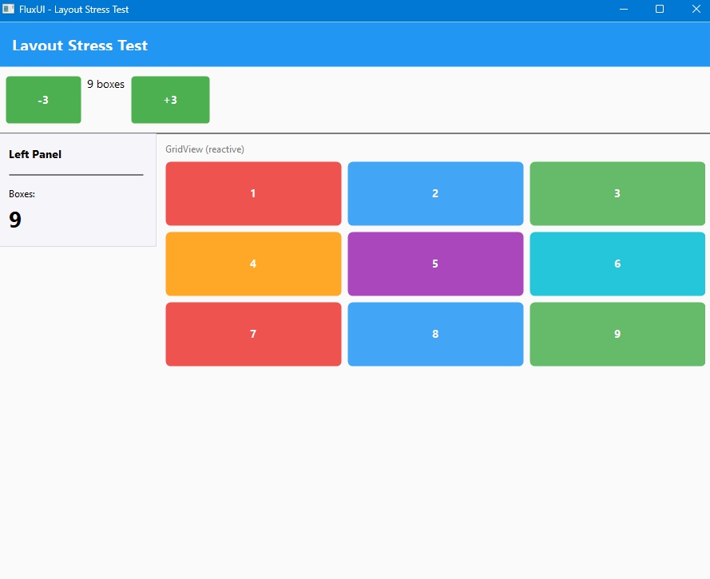
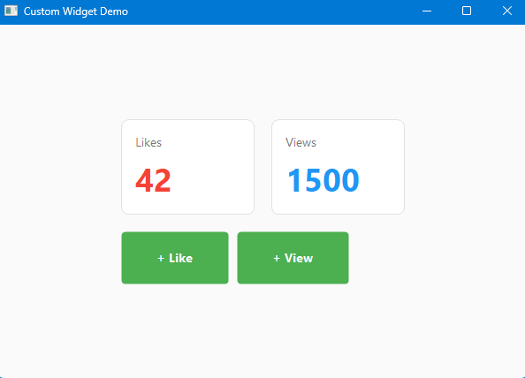
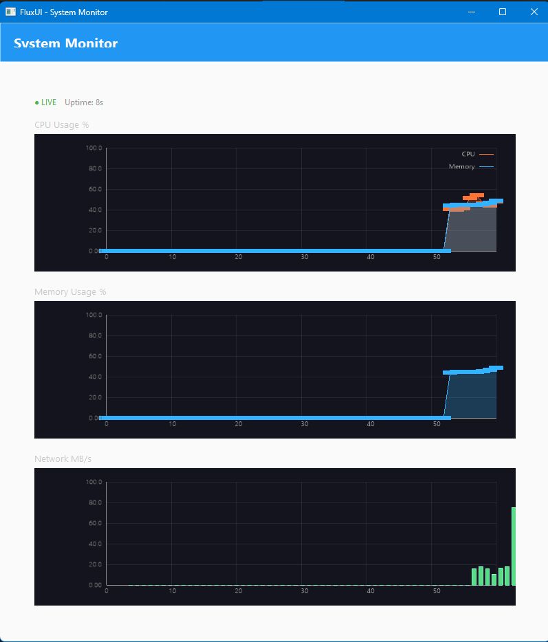
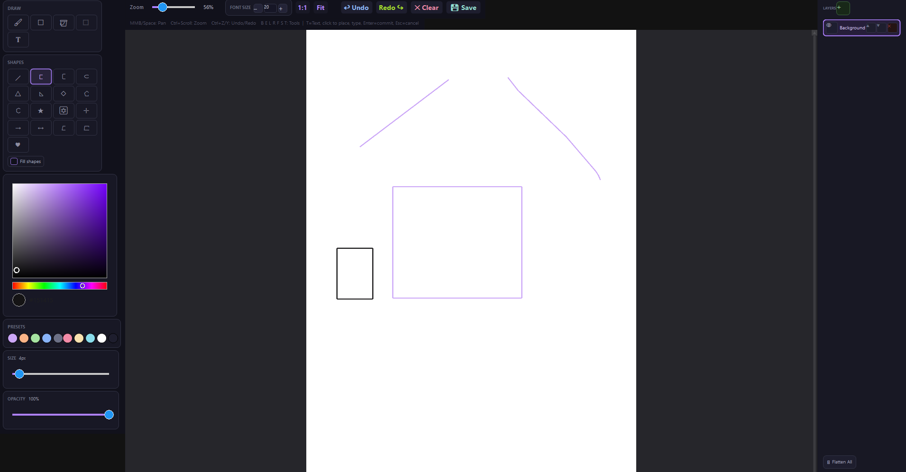
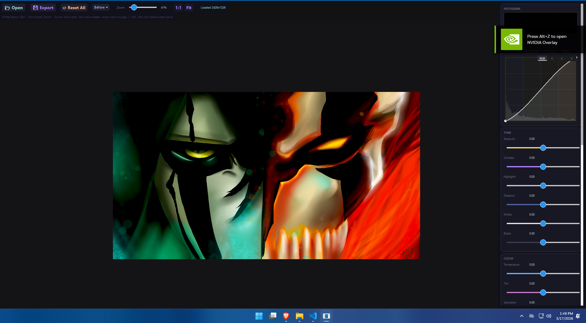
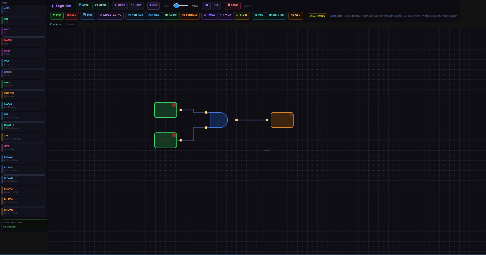
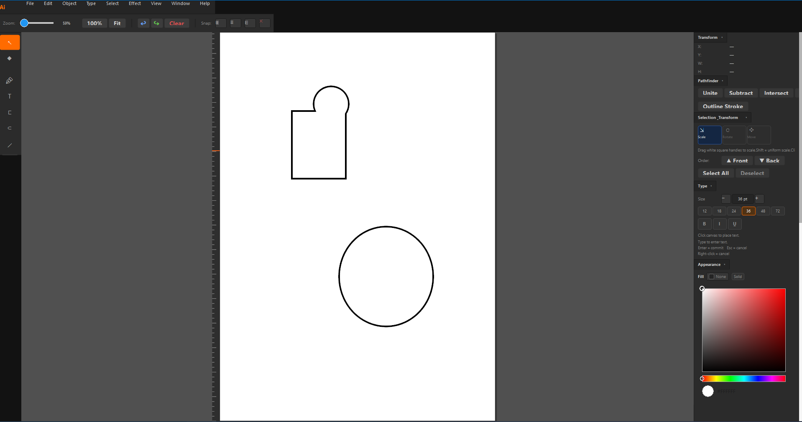

# FluxUI

A declarative, cross-platform widget toolkit for C++.  
Chain methods, compose layouts, bind reactive state — one codebase, six platforms.

**Platforms:** Windows · Linux · macOS · Android · Web · Web SSR  
**Compiler:** MSVC 2022 / GCC / Clang / AppleClang  
**Standard:** C++20  

**Renderer per platform**

| Platform | Renderer |
|---|---|
| Windows | Direct2D |
| Linux | Cairo + Pango |
| macOS | Metal |
| Android | OpenGL ES |
| Web | Canvas + WebGL2 |
| Web SSR | HTML (string-built markup, no GPU/canvas) |

---

## Quick start

### With scripts (recommended)

Clone the repo, drop your app in `lib/main.cpp`, and run the script for your platform:

```bat
scripts\run-windows.bat
```
```bash
scripts/run-linux.sh
scripts/run-macos.sh
```
```bat
scripts\run-android.bat
scripts\run-web.bat
```

See [INSTALL.md](INSTALL.md) for prerequisites and setup per platform.

```cpp
#include "flux/flux.hpp"

class MyApp : public Widget
{
    State<int> counter = 0;

public:
    WidgetPtr build() override
    {
        constexpr int kFabSize = 56;
        constexpr int kAppBarHeight = 56;

        auto appBar =
            Box({
                    Text("My App")
                        ->setFontSize(20)
                        ->setFontWeight(FontWeight::Bold)
                        ->setTextColor(Color::fromRGB(255, 255, 255)),
                })
                ->setDisplay(Display::Flex)
                ->setDirection(FlexDirection::Row)
                ->setAlignItems(AlignItems::Center)
                ->setJustifyContent(JustifyContent::Start)
                ->setPaddingHV(16, 0)
                ->setWidthMode(SizeMode::Full)
                ->setHeightMode(SizeMode::Fixed)
                ->setHeight(kAppBarHeight)
                ->setBackgroundColor(Color::fromRGB(33, 150, 243));

        auto fab =
            Box({
                    Text("+")
                        ->setFontSize(28)
                        ->setFontWeight(FontWeight::Bold)
                        ->setTextColor(Color::fromRGB(255, 255, 255)),
                })
                ->setDisplay(Display::Flex)
                ->setAlignItems(AlignItems::Center)
                ->setJustifyContent(JustifyContent::Center)
                ->setWidthMode(SizeMode::Fixed)
                ->setWidth(kFabSize)
                ->setHeightMode(SizeMode::Fixed)
                ->setHeight(kFabSize)
                ->setBorderRadius(kFabSize / 2)
                ->setBackgroundColor(Color::fromRGB(33, 150, 243))
                ->setPositionMode(Position::Absolute)
                ->setBottomPx(24)
                ->setRightPx(24)
                ->setZIndexVal(1)
                ->setOnClick([this]
                             { counter++; });

        auto body =
            Box({
                    Text("You have pushed the button this many times:")
                        ->setFontSize(14)
                        ->setTextColor(Color::fromRGB(90, 90, 90)),
                    Text(counter)
                        ->setFontSize(40)
                        ->setFontWeight(FontWeight::Bold),
                })
                ->setDisplay(Display::Flex)
                ->setDirection(FlexDirection::Column)
                ->setAlignItems(AlignItems::Center)
                ->setJustifyContent(JustifyContent::Center)
                ->setGap(8)
                ->setWidthMode(SizeMode::Full)
                ->setHeightMode(SizeMode::Full)
                ->setFlexGrow(1); // takes all remaining height below the app bar

        return Box({
                       appBar,
                       body,
                       fab,
                   })
            ->setDisplay(Display::Flex)
            ->setDirection(FlexDirection::Column)
            ->setWidthMode(SizeMode::Full)
            ->setHeightMode(SizeMode::Full)
            ->setBackgroundColor(Color::fromRGB(245, 245, 250));
    }
};

// ============================================================
//  Entry point
// ============================================================

WidgetPtr createApp(FluxUI *app)
{
    return FluxApp()
        .setTheme(AppTheme::light())
        .build(std::make_shared<MyApp>());
}
```

> `Box` is the single general-purpose container widget — see [Box](#box) for
> `Display::Flex` / `Display::Grid` / `Display::Block`, and [Map](#map) for
> rendering dynamic lists.

---

## Screenshots

<p align="center">
  
  
</p>
<p align="center"><em>Layout system · Reactive counter</em></p>

<p align="center">
  
  
</p>
<p align="center"><em>Graph widget · Paint canvas</em></p>

<p align="center">
  
  
</p>
<p align="center"><em>Photo editor · Logic simulator</em></p>

<p align="center">
  
</p>
<p align="center"><em>Illustrator-style app</em></p>

## Table of Contents

- [Components](#components)
- [Display](#display)
- [Box](#box)
- [Map](#map)
- [Interaction](#interaction)
- [Input](#input)
- [Form](#form)
- [Canvas](#canvas)
- [State](#state)
- [Overlay](#overlay)
- [Navigation](#navigation)
- [Data](#data)
- [Media](#media)
- [Network](#network)
- [CLI](#cli)

---

## Components

### Widget

Base class for all UI components. Override `build()` to return your widget tree.

```cpp
class MyApp : public Widget {
    State<int> counter{0};
public:
    WidgetPtr build() override {
        return Flex({
            Text(counter)->setFontSize(18),
            Button("Click", [this]{ counter++; })
        })
        ->setWidthMode(SizeMode::Full)
        ->setHeightMode(SizeMode::Full)
        ->setAlignItems(AlignItems::Center)
        ->setJustifyContent(JustifyContent::Center)
        ->setDirection(FlexDirection::Column)
        ->setGap(8);
    }
};

WidgetPtr createApp(FluxUI* app) {
    return FluxApp()
        .setTheme(AppTheme::light())
        .build(std::make_shared<MyApp>());
}
```

| Method | Description |
|---|---|
| `build()` | Returns the widget tree. Called once at startup — never again on state change |
| `onMount()` | Optional setup hook, called once after the widget is first laid out |
| `onDetach()` | Optional cleanup hook, called when the widget is removed from the tree |

> **Key difference from Flutter:** `build()` is called **once**. State changes flow directly to bound widgets via the observer system — no rebuild is triggered.

**Layout properties**

| Property | Type | Description |
|---|---|---|
| `widthMode` / `heightMode` | `SizeMode` | `Fixed` — exact size · `Fit` — shrink to content · `Full` — fill parent |
| `flexGrow` | `int` | How much free space this widget takes (0 = don't grow) |
| `flexShrink` | `int` | Whether this widget shrinks when space is tight (default 1) |
| `flexBasis` | `int` | Starting size before flex is applied (-1 = auto) |
| `padding` / `paddingLeft/Right/Top/Bottom` | `int` | Inner spacing |
| `margin` / `marginLeft/Right/Top/Bottom` | `int` | Outer spacing |
| `minWidth` / `minHeight` | `int` | Size floor |
| `maxWidth` / `maxHeight` | `int` | Size ceiling |
| `alignment` | `Alignment` | Self-alignment within parent |
| `visible` | `bool` | Hidden widgets take no space and receive no events |

**Appearance**

| Property | Type | Description |
|---|---|---|
| `backgroundColor` | `Color` | Fill color (requires `hasBackground = true`) |
| `borderColor` / `borderWidth` / `borderRadius` | — | Border styling (requires `hasBorder = true`) |
| `hoverBackgroundColor` / `hoverTextColor` / `hoverBorderColor` | `Color` | Automatically applied on hover |
| `fontSize` / `fontWeight` / `fontFamily` | — | Text styling inherited by children |

**Events**

| Property | Type | Description |
|---|---|---|
| `onClick` | `ClickHandler` | Fires on left click |
| `onHover` | `HoverHandler` | Fires with `true` on enter, `false` on leave |
| `onRightClick` | `function<bool(int,int)>` | Fires on right click with cursor position |

---

### Passing state to children

The parent owns the state. Children receive it as a `State<T>&` reference in
their constructor — no copies, no wrappers, no special syntax.

```cpp
class CounterDisplay : public Widget {
    State<int>& counter;
public:
    CounterDisplay(State<int>& counter) : counter(counter) {}

    WidgetPtr build() override {
        return Flex({
            Text("Current count:"),
            Text(counter),
            Text(counter, [](int v) {
                return v % 2 == 0 ? "Even" : "Odd";
            })
        })->setHeightMode(SizeMode::Fit);
    }
};

class CounterControls : public Widget {
    State<int>& counter;
public:
    CounterControls(State<int>& counter) : counter(counter) {}

    WidgetPtr build() override {
        return Flex({
            Button("Increment", [this]{ counter++;       }),
            Button("Decrement", [this]{ counter--;       }),
            Button("Reset",     [this]{ counter.set(0);  })
        });
    }
};

class MyApp : public Widget {
    State<int> counter{0};  // owned here
public:
    WidgetPtr build() override {
        return Flex({
            Flex({ Text("Nav") })
                ->setBackgroundColor(Color::fromRGB(50, 50, 150))
                ->setPadding(12)
                ->setWidthMode(SizeMode::Full)
                ->setHeight(50)
                ->setAlignItems(AlignItems::Center)
                ->setJustifyContent(JustifyContent::Center),

            Flex({
                std::make_shared<CounterDisplay>(counter),
                std::make_shared<CounterControls>(counter)
            })->setDirection(FlexDirection::Column)
        })
        ->setDirection(FlexDirection::Column)
        ->setGap(8)
        ->setPadding(16)
        ->setAlignItems(AlignItems::Stretch)
        ->setWidthMode(SizeMode::Full)
        ->setHeightMode(SizeMode::Full);
    }
};
```

A few things to note:

- **Ownership stays in the parent.** `MyApp` declares `State<int> counter{0}` as a member. Children hold a `&` reference — they can read and mutate it but never outlive it.
- **Any child can write.** `CounterControls` calls `counter++`, `counter--`, and `counter.set(0)` directly. Both `CounterDisplay` and any other widget bound to `counter` update automatically.
- **`Text` accepts state directly.** `Text(counter)` renders the current value and re-renders whenever it changes. The optional transform overload `Text(counter, fn)` lets you derive a string from the value — here used to show `"Even"` or `"Odd"`.
- **Pass with `std::make_shared`.** Children are heap-allocated widgets, so pass the reference through the constructor: `std::make_shared<CounterDisplay>(counter)`.

---

## Display

### Text

Renders a string of text. Auto-sizes to its content by default.

```cpp
Text("Hello, world!")
    ->setFontSize(18)
    ->setFontWeight(FontWeight::Bold)
    ->setTextColor(RGB(30, 30, 30));

// Reactive
Text(myState);
Text(count, [](int v){ return "Count: " + std::to_string(v); });

// Full TextStyle
StyledText("Hello", TextStyle{}.setFontSize(20).setBold(true));
```

**Factory**

| Signature | Description |
|---|---|
| `Text(string)` | Static text |
| `Text(State<T>)` | Reactive — auto-updates when state changes |
| `Text(State<T>, transform)` | Reactive with a custom format function |
| `StyledText(string, TextStyle)` | Static text with a full `TextStyle` applied upfront |

**Methods**

| Method | Type | Description |
|---|---|---|
| `setText(string)` | `string` | Set or change displayed text |
| `setText(State<T>)` | State | Reactive text binding |
| `setText(State<T>, transform)` | State + fn | Reactive text with transform |
| `setFontSize(size)` | `int` | Font size in points |
| `setFontWeight(weight)` | `FontWeight` | `Normal` or `Bold` |
| `setFontFamily(family)` | `string` | Font family name |
| `setTextScaleFactor(factor)` | `float` | Scales font size (1.0 = normal) |
| `setTextColor(color)` | `Color` | Text color |
| `setTextColor(State<T>, transform)` | State | Reactive text color |
| `setHoverTextColor(color)` | `Color` | Text color on hover |
| `setLetterSpacing(spacing)` | `float` | Extra space between characters |
| `setWordSpacing(spacing)` | `float` | Extra space between words |
| `setHeight(h)` | `float` | Line height multiplier (1.0 = natural; 1.5 = 50% extra leading) |
| `setTextAlign(align)` | `TextAlign` | `Left · Center · Right · Justify · Start · End` |
| `setTextAlignVertical(align)` | `TextAlignVertical` | `Top · Center · Bottom` |
| `setOverflow(overflow)` | `TextOverflow` | `Clip · Ellipsis · Fade · Visible` |
| `setSoftWrap(wrap)` | `bool` | Word-wrap at boundaries (default `true`) |
| `setMaxLines(lines)` | `int` | Max visible lines; 0 = unlimited |
| `setTextDirection(dir)` | `TextDirection` | `LTR` or `RTL` |
| `setDecoration(decoration)` | `TextDecoration` | Underline, strikethrough, overline |
| `setDecorationColor(color)` | `Color` | Decoration line color |
| `setDecorationStyle(style)` | `TextDecorationStyle` | Solid, dashed, dotted, double, wavy |
| `setDecorationThickness(t)` | `int` | Decoration line thickness |
| `setShadow(shadow)` | `TextShadow` | Single text shadow |
| `setShadows(shadows)` | `vector<TextShadow>` | Multiple text shadows |
| `clearShadows()` | — | Remove all shadows |
| `setTextBackground(color)` | `Color` | Background painted behind each text line |
| `clearTextBackground()` | — | Remove per-line background |
| `setTextStyle(style)` | `TextStyle` | Apply a full `TextStyle` at once |
| `setPadding(p)` | `int` | Uniform padding |
| `setPaddingH(p)` | `int` | Horizontal padding (left + right) |
| `setPaddingV(p)` | `int` | Vertical padding (top + bottom) |
| `setPaddingLRTB(l, r, t, b)` | `int ×4` | Per-side padding |
| `setBackgroundColor(color)` | `Color` | Widget background fill |
| `setBorderRadius(r)` | `int` | Corner rounding for background |
| `setWidth(w)` | `int` | Fixed widget width |
| `setWidgetHeight(h)` | `int` | Fixed widget height |
| `setMinWidth(w)` | `int` | Minimum width constraint |

---

### Icon

Renders a glyph from the `FluxIcons` icon set.

```cpp
Icon(FluxIcons::Settings)
Icon(FluxIcons::Menu, 20)
Icon(state, [](bool v) -> FluxIcons::IconGlyph {
    return v ? FluxIcons::Check : FluxIcons::Close;
})
```

**Factory**

| Signature | Description |
|---|---|
| `Icon(glyph)` | Static glyph at default size (16px) |
| `Icon(glyph, size)` | Static glyph at explicit size |
| `Icon(State<T>, transform)` | Reactive glyph — transform maps `T` to `FluxIcons::IconGlyph` |
| `Icon(State<T>, transform, size)` | Reactive glyph at explicit size |

**Methods**

| Method | Description |
|---|---|
| `setSize(size)` | Icon size in points |
| `setColor(color)` | Icon color |
| `setHoverColor(color)` | Icon color on hover |
| `setIconFontFamily(family)` | Override icon font |
| `setGlyph(glyph)` | Set or change glyph (`FluxIcons::IconGlyph`) |
| `setGlyph(State<T>, transform)` | Reactive glyph binding |

---

### Divider

A 1px horizontal rule that fills available width.

```cpp
Divider()
```

---

### ProgressBar

Horizontal progress indicator with solid or gradient fill.

```cpp
ProgressBar(0.65)
    ->setProgressColors({ RGB(33,150,243), RGB(0,200,150) })
    ->setHeight(8)
    ->setBorderRadius(4);

ProgressBar()->setValue(progressState);
```

**Factory**

| Signature | Description |
|---|---|
| `ProgressBar()` | Progress bar starting at 0.0 |
| `ProgressBar(value)` | Progress bar with initial fill level (0.0–1.0) |

**Methods**

| Method | Type | Description |
|---|---|---|
| `setValue(v)` | `double` 0–1 | Static fill level |
| `setValue(State<double>)` | State | Reactive fill level |
| `setProgressColors(colors)` | `vector<Color>` | Solid or gradient fill |
| `setBackgroundColor(color)` | `Color` | Track background |
| `setBorderColor(color)` | `Color` | Track border |
| `setBorderWidth(w)` | `int` | Border thickness |
| `setBorderRadius(r)` | `int` | Corner rounding |
| `setHeight(h)` | `int` | Bar height (default 12px) |
| `setWidth(w)` | `int` | Fixed width |

---

### Graph

OpenGL-rendered chart widget supporting Line, Bar, and Area types.

```cpp
Graph(500, 300)
    ->addSeries("Temperature", {22,24,27,23,19}, 1.0f, 0.4f, 0.2f)
    ->setTitle("Daily Temps")
    ->setXLabels({"Mon","Tue","Wed","Thu","Fri"});

// Reactive
Graph(600, 300)
    ->addSeries("CPU", cpuDataState, 0.0f, 1.0f, 0.4f)
    ->setType(GraphType::Area);
```

**Factory**

| Signature | Description |
|---|---|
| `Graph()` | Default 400×300 graph |
| `Graph(w, h)` | Fixed-size graph |

**Methods**

| Method | Type | Description |
|---|---|---|
| `addSeries(label, values, r, g, b)` | `string`, `vector<float>` | Add static data series |
| `addSeries(label, State<...>, r,g,b)` | State | Reactive series |
| `bindSeries(idx, State)` | `int`, State | Retrofit reactive binding |
| `setType(type)` | `GraphType` | `Line` · `Bar` · `Area` |
| `setTitle(t)` | `string` | Chart title |
| `setXLabels(labels)` | `vector<string>` | X-axis tick labels |
| `setYRange(min, max)` | `float, float` | Manual Y-axis range |
| `setShowGrid(v)` | `bool` | Toggle grid lines |
| `clearSeries()` | — | Remove all series |
| `setSize(w, h)` | `int, int` | Resize the widget |

---

### Image

Renders an image file with five fit modes. Supports local assets, network URLs, and in-memory buffers. All loading is asynchronous. A single overloaded `Image(...)` factory covers every source — path vs. URL is auto-detected by scheme prefix.

```cpp
// Local asset — auto-detected (no http/https prefix)
Image("photo.jpg")
    ->setWidth(300)
    ->setHeight(200)
    ->setFit(ImageFit::Cover);

// Network image — auto-detected (http/https prefix)
Image("https://example.com/photo.jpg")
    ->setWidth(300)
    ->setHeight(200);

// In-memory buffer
Image(myBytes)
    ->setWidth(300);

// Empty widget — load later
Image()
    ->setImagePath("photo.jpg")
    ->setWidth(300);

// Circle avatar
Image("avatar.png")->setWidth(64)->setHeight(64)->setBorderRadius(32);
```

**Factory**

| Signature | Description |
|---|---|
| `Image()` | Empty image widget — call `setImagePath()` or `setUrl()` to load |
| `Image(pathOrUrl, postToUI = true)` | Local file or HTTP/HTTPS URL, auto-detected by scheme prefix; `postToUI` only applies to the network path |
| `Image(bytes)` | Decode from a `vector<uint8_t>` |
| `Image(data, len)` | Decode from a raw pointer + length |
| `ImageWidget::asset(path)` | Static named constructor — local file only, no auto-detection |
| `ImageWidget::network(url, postToUI)` | Static named constructor — network URL only, no auto-detection |
| `ImageWidget::memory(bytes)` | Static named constructor — same as `Image(bytes)` |

**ImageFit modes**

| Value | Description |
|---|---|
| `ImageFit::Fill` | Stretch to fill — may distort |
| `ImageFit::Contain` | Fit inside bounds, letterbox (default) |
| `ImageFit::Cover` | Fill bounds, crop edges |
| `ImageFit::None` | Original size, positioned by `imageAlignment` |
| `ImageFit::ScaleDown` | Like None but scales down if larger than container |

**Methods**

| Method | Type | Description |
|---|---|---|
| `setImagePath(path)` | `string` | Load or swap a local file at runtime |
| `setUrl(url, postToUI)` | `string, bool` | Load or swap a network URL at runtime |
| `loadFromUrl(url, postToUI)` | `string, bool` | Explicit async network load |
| `setFit(mode)` | `ImageFit` | Sizing/cropping mode |
| `setRepeat(repeat)` | `ImageRepeat` | `NoRepeat · Repeat · RepeatX · RepeatY` |
| `setFilterQuality(quality)` | `FilterQuality` | `None · Low · Medium · High` |
| `setImageAlignment(alignment)` | `Alignment` | Positioning of image within the box (used by `None`/`ScaleDown`) |
| `setTintColor(color)` | `Color` | Color overlay blended over the image |
| `setWidth(w)` | `int` | Fixed width |
| `setHeight(h)` | `int` | Fixed height |
| `setBorderRadius(r)` | `int` | Corner rounding |
| `setPadding(p)` | `int` | Inner padding |
| `setPlaceholderColor(c)` | `Color` | Fill shown while loading |
| `setErrorColor(c)` | `Color` | Fill shown on load error |
| `setLoadingBuilder(fn)` | `() -> WidgetPtr` | Custom widget shown while loading |
| `setErrorBuilder(fn)` | `() -> WidgetPtr` | Custom widget shown on error |

---

### Svg

Renders inline SVG markup or an `.svg` asset file. Parses a practical subset
of SVG 1.1 (`path`, `rect`, `circle`/`ellipse`, `line`, `polyline`/`polygon`,
`g` groups, `transform`, `style=` attributes, gradients are ignored) and
paints it with the same cross-platform primitives every other widget uses.
A single overloaded `Svg(...)` factory covers both sources — markup vs.
asset path is auto-detected by whether the string starts with `<`.

```cpp
// Inline markup — auto-detected (starts with '<')
Svg("<svg viewBox='0 0 24 24'><path d='M12 2L2 22h20z' fill='#333'/></svg>")
    ->setWidth(48)
    ->setHeight(48);

// Asset file — auto-detected (no leading '<')
Svg("icons/settings.svg")
    ->setFit(SvgFit::Contain)
    ->setWidth(32)
    ->setHeight(32);

// Recolor every fill/stroke to a single flat tint (icon tinting)
Svg("icons/heart.svg")
    ->setTintColor(RGB(233, 30, 99))
    ->setWidth(24)
    ->setHeight(24);
```

**Factory**

| Signature | Description |
|---|---|
| `Svg(svgTextOrPath)` | Inline markup or local asset path, auto-detected by leading `<` |
| `SvgWidget::fromString(svgText)` | Static named constructor — inline markup only, no auto-detection |
| `SvgWidget::asset(path)` | Static named constructor — local asset file only, no auto-detection |

**SvgFit modes**

| Value | Description |
|---|---|
| `SvgFit::Fill` | Stretch to fill — may distort |
| `SvgFit::Contain` | Fit inside bounds, letterbox (default) |
| `SvgFit::Cover` | Fill bounds, crop edges |
| `SvgFit::None` | Original size, positioned by alignment |
| `SvgFit::ScaleDown` | Like `None` but scales down if larger than container |

**Methods**

| Method | Type | Description |
|---|---|---|
| `setSource(svgText)` | `string` | Load or swap inline markup at runtime |
| `loadAsset(path)` | `string` | Load or swap a local `.svg` file at runtime |
| `setFit(mode)` | `SvgFit` | Sizing/cropping mode |
| `setAlignment(a)` | `Alignment` | Positioning within the box (used by `None`/`ScaleDown`) |
| `setTintColor(color)` | `Color` | Flat color override for every fill/stroke in the document; leave unset (alpha 0) to keep each shape's own colors |
| `setWidth(w)` | `int` | Fixed width |
| `setHeight(h)` | `int` | Fixed height |

> Auto-sizes to the SVG's `viewBox` (or `width`/`height` attributes) when no
> fixed size is set, same as `Image`'s default `Contain` behavior.

---


## Box

`Box` is the single general-purpose container widget. It replaces the old
`Flex`/`FlexBuilder`/`Grid` widgets with one widget whose layout **algorithm**
is chosen via `setDisplay()`, the same way CSS chooses between
`display: flex`, `display: grid`, and normal block flow on the same kind of
box:

```cpp
Box({...})->setDisplay(Display::Flex)->setDirection(FlexDirection::Row);
Box({...})->setDisplay(Display::Grid)->setColumns({fr(1), fr(1)});
Box({...});                                  // Display::Block (default)
```

`Flex`, `Row`, and `Column` are thin convenience factories that return a
`Box` pre-configured with `Display::Flex`:

```cpp
Flex({...})    // Box + Display::Flex + FlexDirection::Column
Row({...})     // Box + Display::Flex + FlexDirection::Row
Column({...})  // Box + Display::Flex + FlexDirection::Column
```

Every display mode shares padding, background/border, `scrollable()`, `gap`,
position:`absolute` children, and item-source splicing (see [Map](#map)), so
a `Map(...)` call can sit anywhere in a `Box`'s child list regardless of
which display mode that `Box` is using:

```cpp
Box({
    Text("Header"),
    Map(todos, keyFn, [](int i, const Todo &t){ return Text(t.text); }),
    Text("Footer"),
})->setDisplay(Display::Flex)->setDirection(FlexDirection::Column);
```

### Display modes

| Value | Description |
|---|---|
| `Display::Block` | Default. Plain top-to-bottom document flow — children stack vertically, each filling the container's content width unless `Fixed`. Scrolling, when enabled, is always vertical. |
| `Display::Flex` | CSS Flexbox-compatible layout — direction, wrapping, alignment, gaps, and scrolling all work the same way as web Flexbox. |
| `Display::Grid` | Fixed or responsive column/row tracks, explicit or auto item placement. |

### Direction (Flex)

| Value | Description |
|---|---|
| `FlexDirection::Row` | Left to right (default) |
| `FlexDirection::RowReverse` | Right to left |
| `FlexDirection::Column` | Top to bottom |
| `FlexDirection::ColumnReverse` | Bottom to top |

### Wrap (Flex)

| Value | Description |
|---|---|
| `FlexWrap::NoWrap` | Single line, items may overflow (default) |
| `FlexWrap::Wrap` | Items wrap to new lines |
| `FlexWrap::WrapReverse` | Items wrap in reverse direction |

### JustifyContent / AlignItems / AlignContent

Shared between Flex (main/cross axis) and Grid (`justifyContent`/`alignItems`/row distribution).

| JustifyContent | Description |
|---|---|
| `Start` | Pack toward start (default) |
| `End` | Pack toward end |
| `Center` | Center the group |
| `SpaceBetween` | Equal gaps between items, no outer gap |
| `SpaceAround` | Equal gaps around each item |
| `SpaceEvenly` | Equal gaps between items and edges |

| AlignItems | Description |
|---|---|
| `Start` | Align to start edge |
| `End` | Align to end edge |
| `Center` | Center each item |
| `Stretch` | Stretch to fill cross axis (default) |
| `Baseline` | Align to text baseline |

### Grid tracks

```cpp
Box({
    Text("A"), Text("B"), Text("C"), Text("D"),
})
->setDisplay(Display::Grid)
->setColumns({ fr(1), fr(1), px(120) })
->setRows(repeat(2, autoTrack()))
->setColumnGap(12)
->setRowGap(12);
```

| Helper | Description |
|---|---|
| `px(n)` | Fixed-size track |
| `fr(n = 1)` | Fractional remaining space |
| `fillTrack(n = 1)` | Fills remaining space after fixed/fr tracks |
| `autoTrack()` | Sized to its content |
| `minContent()` / `maxContent()` | Min/max content sizing |
| `repeat(count, pattern)` | Repeats a track pattern `count` times |

Explicit per-item placement (Grid mode only) is done by wrapping a child in `BoxItem(...)`:

```cpp
Box({
    BoxItem(Text("Wide"))->spanCols(2),
    BoxItem(Text("Tall"))->at(3, 1)->spanRows(2),
    Text("Auto-placed"),
})->setDisplay(Display::Grid)->setColumns({ fr(1), fr(1), fr(1) });
```

| Method | Description |
|---|---|
| `atCol(c)` / `atRow(r)` / `at(c, r)` | Explicit 1-based column/row placement |
| `spanCols(n)` / `spanRows(n)` / `span(cols, rows)` | Column/row span |
| `withAlignSelf(a)` / `withJustifySelf(a)` | Override alignment for this item only |

### Methods

| Method | Type | Description |
|---|---|---|
| `setDisplay(d)` | `Display` | `Block` · `Flex` · `Grid` |
| `setDirection(d)` | `FlexDirection` | Flex main axis direction |
| `setWrap(w)` | `FlexWrap` | Flex line wrapping behavior |
| `setColumns(tracks)` | `vector<TrackDef>` | Grid column tracks |
| `setRows(tracks)` | `vector<TrackDef>` | Grid row tracks |
| `setColumnGap(px)` / `setRowGap(px)` | `int` | Grid per-axis gap (falls back to `gap` if unset) |
| `setJustifyItems(a)` | `AlignItems` | Grid per-cell horizontal default |
| `setJustifyContent(j)` | `JustifyContent` | Main axis distribution |
| `setAlignItems(a)` | `AlignItems` | Cross axis alignment per item |
| `setAlignContent(a)` | `AlignContent` | Cross axis distribution of lines |
| `setGap(px)` | `int` | Gap between all items |
| `setScrollable(v)` | `bool` | Enable scroll and fling |
| `setPadding(px)` / `setPaddingHV(h, v)` | `int` | Inner padding |
| `setBackgroundColor(c)` | `Color` | Background fill |
| `setBorderColor(c)` / `setBorderWidth(w)` / `setBorderRadius(r)` | — | Border styling |
| `setWidthMode(m)` / `setHeightMode(m)` | `SizeMode` | `Fixed` · `Fit` · `Full` |
| `setWidth(w)` / `setHeight(h)` | `int` | Fixed dimensions (sets mode to `Fixed`) |
| `setFlexGrow(n)` / `setFlexShrink(n)` / `setFlexBasis(px)` | `int` | Flex-item sizing within a parent Flex `Box` |
| `setOrder(n)` | `int` | Layout order override |
| `setOnClick(fn)` | `ClickHandler` | Opts this Box in as a click target |
| `responsive(bp, fn)` | `Breakpoint, fn(BoxProps&)` | Override any prop at a breakpoint |

### Position:absolute

Any `Box` (or other widget) can escape normal flow and be positioned
relative to its nearest laid-out ancestor — used for things like a
floating action button:

```cpp
fab->setPositionMode(Position::Absolute)
   ->setBottomPx(24)
   ->setRightPx(24)
   ->setZIndexVal(1);
```

| Method | Description |
|---|---|
| `setPositionMode(p)` | `Position::Static` (default) or `Position::Absolute` |
| `setTopPx(v)` / `setRightPx(v)` / `setBottomPx(v)` / `setLeftPx(v)` | Offsets from the matching edge |
| `setZIndexVal(z)` | Paint order among sibling absolute children |

### Responsive overrides

Props can be overridden at any breakpoint using a mobile-first cascade.
Overrides stack — `Sm` applies at 640px and up, `Md` at 768px and up, and so on.

```cpp
Box({ ... })
->setDisplay(Display::Flex)
->setDirection(FlexDirection::Column)       // base (mobile): stacked
->responsive(Breakpoint::Md, [](BoxProps& p) {
    p.direction = FlexDirection::Row;       // tablet+: side by side
    p.gap = 16;
})
->responsive(Breakpoint::Lg, [](BoxProps& p) {
    p.justify = JustifyContent::SpaceBetween;
});
```

Default breakpoint thresholds match Tailwind CSS:

| Breakpoint | Default threshold |
|---|---|
| `Sm` | 640px |
| `Md` | 768px |
| `Lg` | 1024px |
| `Xl` | 1280px |
| `Xxl` | 1536px |

Override globally with:

```cpp
BreakpointProvider::set({ .sm=480, .md=768, .lg=1024 });
```

---

## Map

`Map` is the `list.map()` equivalent — it decides which widgets exist for a
list (lazy building, keyed caching, reactivity to `State<vector<T>>`,
optional virtualization) and hands them to whichever `Box` it's nested
inside. Layout, scrolling, and gestures belong entirely to that `Box`; `Map`
itself contributes zero pixels and never appears in the render tree.

```cpp
Box({
    Text("Header"),
    Map(todos, [](int i, const Todo &t){ return Text(t.text); }),
    Text("Footer"),
})->setDisplay(Display::Flex)->setDirection(FlexDirection::Column);
```

### Static usage (no reactivity, built once)

```cpp
Map(itemCount, [](int i){ return Text("Item " + std::to_string(i)); })
Map(myVector, [](int i, const T &item){ return ...; })
```

### Reactive usage (rebuilds when State<vector<T>> changes)

```cpp
auto todos = app->useState(std::vector<Todo>{});
Map(todos,
    [](int, const Todo& t){ return FlexItemKey::fromInt64(t.id); },
    [](int i, const Todo& t){ return Text(t.text); })
->setDirection(FlexDirection::Column);

// Any mutation to the bound State auto-updates the list
todos.push_back({ nextId++, "Buy milk" });
todos.erase(2);
```

A stable key function is **required** for reactive/mutable lists — without
it, deleting item[2] makes item[3]'s cached widget (and its state: typed
text, scroll position, etc.) appear at item[2]'s slot, because the cache is
keyed by position instead of identity. Static, append-only, or
never-mutated lists are fine with the default index keys.

```cpp
FlexItemKey::fromIndex(i)          // position-based — safe only for static lists
FlexItemKey::fromInt64(item.id)    // stable integer id
FlexItemKey::fromString(item.uuid) // stable string id
```

> Without a `keyFn`, a debug warning fires on first use reminding you to add one.

### Virtualization

Only meaningful when the enclosing `Box` is in `Flex` or `Block` display
mode with `FlexWrap::NoWrap` and `setScrollable(true)` — that's the only
case with a single well-defined main axis + scroll offset to virtualize
against. In any other context (Grid mode, or a non-scrollable container)
`Box` builds every item, same as `setVirtualized(false)`.

```cpp
Map(items, keyFn, builderFn)
    ->setItemExtent(48)      // every item is exactly 48px along the main axis
    ->setVirtualized(true);  // only build/layout items near the viewport
```

### Factory overloads

| Signature | Description |
|---|---|
| `Map(itemCount, builderFn)` | Index-count form, static |
| `Map(vector, builderFn)` | Static snapshot with index keys — safe for append-only lists |
| `Map(State<vector>, builderFn)` | Reactive, index keys — safe for append-only lists |
| `Map(State<vector>, keyFn, builderFn)` | Reactive — auto-rebuilds on state change, with stable keys |

### Methods

| Method | Type | Description |
|---|---|---|
| `setItemCount(n)` | `int` | Total number of items |
| `setItemBuilder(fn)` | `(int) -> WidgetPtr` | Builder called per item |
| `setKeyFn(fn)` | `(int) -> FlexItemKey` | Stable key per item — required for mutable lists |
| `setItemExtent(px)` | `int` | Fixed item size along the main axis (required for virtualization) |
| `setVirtualized(v)` | `bool` | Skip building/laying out off-screen items — requires `setItemExtent` and a scrollable, single-axis parent `Box` |
| `invalidateItems()` | — | Discard all cached widgets and rebuild |
| `invalidateItem(idx)` | `int` | Discard one cached widget by index |

## Interaction

### Button

Clickable widget with a background. Accepts a text label or a child widget.

```cpp
Button("Save", [&]{ save(); })
    ->setBackgroundColor(RGB(76,175,80))
    ->setBorderRadius(6)
    ->setPadding(12);

// Widget child
Button(Row({Icon(FluxIcons::Upload), Text("Upload")}), [&]{ upload(); });
```

**Factory**

| Signature | Description |
|---|---|
| `Button(text, onClick)` | Text label button |
| `Button(child, onClick)` | Widget child button |

**Methods**

| Method | Type | Description |
|---|---|---|
| `setOnClick(handler)` | `ClickHandler` | Click callback |
| `setChild(widget)` | `WidgetPtr` | Replace content widget |
| `setBackgroundColor(color)` | `Color` | Button background |
| `setHoverBackgroundColor(color)` | `Color` | Background on hover |
| `setTextColor(color)` | `Color` | Label text color |
| `setBorderRadius(r)` | `int` | Corner rounding |
| `setPadding(p)` | `int` | Uniform padding |
| `setPaddingAll(l, t, r, b)` | `int ×4` | Per-side padding |
| `setWidth(w)` | `int` | Fixed width |
| `setHeight(h)` | `int` | Fixed height |

---

## Input

### TextInput

Single-line text field with cursor, scroll, placeholder, two-way `State<string>`
binding, and per-type validation.

```cpp
TextInput("Enter your name...")
    ->setInputValue(nameState)
    ->setWidth(320);


// Built-in validation (Email/Url/Number) — border turns red after first
// edit/blur if invalid; empty is always treated as neutral/valid.
TextInput("you@example.com")
    ->setInputType(InputType::Email)
    ->setOnValidationChanged([](bool ok){ std::cout << ok << "\n"; });

// Custom validator overrides the built-in check entirely — required for
// types with no built-in rule (Text, Password, Tel, Search).
TextInput("Phone")
    ->setInputType(InputType::Tel)
    ->setValidator([](const std::string& s){
        return s.empty() || std::count_if(s.begin(), s.end(), ::isdigit) >= 7;
    });
``

**InputType**

| Value | Keystroke filtering | Built-in validation | Rendering |
|---|---|---|---|
| `InputType::Text` | none | none | plain |
| `InputType::Password` | none | none | masked with `maskChar` |
| `InputType::Number` | digits, one `.`, leading `-` only | numeric parse | plain |
| `InputType::Email` | none | `user@host.tld` pattern | plain |
| `InputType::Tel` | none | none — supply a `setValidator` | plain |
| `InputType::Url` | none | `scheme://...` pattern | plain |
| `InputType::Search` | none | none | plain |

> `Number` here is still a `string`-backed field with filtered keystrokes,
> not a numeric `State<T>` — use [`NumberInput`/`SpinBox`](#numberinput--spinbox)
> when you need an actual bound number.

```

| Method | Type | Description |
|---|---|---|
| `setInputValue(State<string>)` | State | Two-way reactive binding |
| `setPlaceholder(text)` | `string` | Hint shown when empty |
| `setInputType(t)` | `InputType` | Selects filtering, masking, and built-in validation (default `Text`) |
| `setMaskChar(c)` | `wchar_t` | Glyph used to mask `Password` values (default `•`) |
| `setValidator(fn)` | `(const string&) -> bool` | Overrides the built-in per-type check entirely |
| `setOnValidationChanged(fn)` | `void(bool)` | Fires whenever validity flips |
| `setInvalidBorderColor(c)` | `Color` | Border color shown once touched and invalid |
| `isValid()` | `bool` | Current validity (empty value is always valid/neutral) |
| `isTouched()` | `bool` | `true` after first edit or blur — gates when invalid styling shows |
| `setWidth(w)` | `int` | Fixed width |

---

## Form

`Form` is a thin coordinator, not a primitive — it stacks its children in a
column (via `Box`) and has no idea what any individual field is. At
`submit()` time it walks its subtree, finds every descendant implementing
`Validatable` (`TextInput` today — any future widget opts in the same way
via `dynamic_cast<Validatable*>`), touches it to reveal error state, and
folds every field's validity into one aggregate result.

`Form` deliberately does **not** collect field values into a map — build
fields as local variables, pass them into `setChildren()`, and read them
back directly (e.g. `emailInput->inputValue`) after a successful `submit()`.

```cpp
auto email = TextInput("you@example.com")->setInputType(InputType::Email);

// Two-step construction: `form` must exist before the submit button's
// lambda can capture it.
auto form = Form();
form->setChildren({
        email,
        Button("Submit", [form]{
            if (form->submit())
                std::cout << "Valid: " << email->inputValue << "\n";
        }),
    })
    ->setGap(16)
    ->setOnSubmit([email]{ /* fires only when the whole form is valid */ });
```

**Methods**

| Method | Type | Description |
|---|---|---|
| `setChildren(fields)` | `vector<WidgetPtr>` | Fields (and anything else, e.g. a submit `Button`) rendered in order |
| `setDirection(d)` | `FlexDirection` | Stack direction (default `Column`) |
| `setGap(px)` | `int` | Gap between children |
| `setOnSubmit(fn)` | `void()` | Fires from `submit()` only when the form is valid |
| `submit()` | `bool` | Touches every validatable field (revealing invalid ones), returns aggregate validity, fires `onSubmit` if valid |
| `isFormValid()` | `bool` | Read-only validity check — does not touch fields or reveal error state; handy for e.g. disabling a submit button pre-emptively |

### Validatable

Opt-in interface a widget implements (alongside `Widget`) to participate in
a `Form`. `TextInput` implements this today; adding it to a new widget is
all that's required for `Form` to discover it via subtree walk.

```cpp
class Validatable {
public:
    virtual bool isValid() const = 0;
    virtual void markTouched() = 0;
};
```

| Method | Description |
|---|---|
| `isValid()` | Current validity of this field |
| `markTouched()` | Reveals this field's validation state (e.g. flips a "touched" flag so an untouched/empty field doesn't show invalid before the user interacts with it) |


---

### TextArea

Multiline text input with scrollbars, line numbers, selection, and clipboard support.

```cpp
TextArea("Type your message...")
    ->setInputValue(bodyState)
    ->setWidth(400)
    ->setHeight(200)
    ->setLineNumbers(true);
```

**Methods**

| Method | Type | Description |
|---|---|---|
| `setInputValue(State<string>)` | State | Two-way reactive binding |
| `setPlaceholder(text)` | `string` | Hint shown when empty |
| `setLineNumbers(v)` | `bool` | Show line number gutter |
| `setWordWrap(v)` | `bool` | Enable word wrap |
| `setTabSpaces(n)` | `int` | Spaces per Tab key press |
| `setMaxLength(n)` | `int` | Max character count (0 = unlimited) |
| `setFontSize(s)` | `int` | Font size |
| `setWidth(w)` | `int` | Fixed width |
| `setHeight(h)` | `int` | Fixed height |
| `setFlex(n)` | `int` | Flex factor in parent |
| `setScrollbarSize(s)` | `int` | Scrollbar thickness |
| `setScrollbarColor(c)` | `Color` | Idle thumb color |
| `setScrollbarHoverColor(c)` | `Color` | Hover thumb color |
| `setScrollbarTrackColor(c)` | `Color` | Track background |

> **Keyboard:** `Ctrl+A` select all · `Ctrl+C/X/V` clipboard · `Shift+arrows` extend selection · `PgUp/PgDn` page scroll.

---

### NumberInput / SpinBox

Numeric input with up/down arrow buttons, mouse wheel, and direct keyboard editing.

```cpp
NumberInput(0.0, 100.0, 1.0)
    ->setValue(countState)
    ->setPrefix("$")
    ->setSuffix(" kg")
    ->setDecimalPlaces(2)
    ->setWidth(120);

// Alias
SpinBox(0, 255, 1)->setValue(brightnessState);
```

**Factory:** `NumberInput(min, max, step)` · `SpinBox(min, max, step)`

**Methods**

| Method | Type | Description |
|---|---|---|
| `setValue(State<double>)` | State | Two-way double binding |
| `setValue(State<int>)` | State | Two-way int binding |
| `setMin(v)` | `double` | Minimum value |
| `setMax(v)` | `double` | Maximum value |
| `setStep(v)` | `double` | Increment/decrement step |
| `setDecimalPlaces(n)` | `int` | Decimal digits shown (0 = integer) |
| `setPrefix(s)` | `string` | Text prepended to display value |
| `setSuffix(s)` | `string` | Text appended to display value |
| `setOnValueChanged(fn)` | `void(double)` | Fires on every value change |
| `setWidth(w)` | `int` | Fixed width |
| `setFlex(n)` | `int` | Flex factor in parent |

> **Keyboard:** `↑/↓` step · `PgUp/PgDn` step ×10 · `Home/End` jump to min/max · `Enter` commit typed value · `Escape` revert.

---

### Slider

Horizontal range input with draggable thumb and keyboard support.

```cpp
Slider(0.0, 100.0, 1.0)
    ->setValue(volumeState)
    ->setTrackFillColor(RGB(99,102,241))
    ->setOnValueChanged([&](double v){ setVolume(v); });
```

**Factory:** `Slider(min, max, step)`

**Methods**

| Method | Type | Description |
|---|---|---|
| `setValue(State<double>)` | State | Two-way double binding |
| `setValue(State<int>)` | State | Two-way int binding |
| `setMinValue(v)` | `double` | Range minimum |
| `setMaxValue(v)` | `double` | Range maximum |
| `setStep(v)` | `double` | Snap step size |
| `setTrackColor(c)` | `Color` | Unfilled track color |
| `setTrackFillColor(c)` | `Color` | Filled track color |
| `setThumbColor(c)` | `Color` | Thumb color |
| `setOnValueChanged(fn)` | `void(double)` | Change callback |
| `setWidth(w)` | `int` | Fixed width |

---

### Toggle

On/off switch with animated thumb and optional label. Binds to `State<bool>`.

```cpp
Toggle("Dark mode")
    ->setValue(darkModeState)
    ->setTrackOnColor(RGB(99,102,241))
    ->setOnToggleChanged([&](bool v){ applyTheme(v); });
```

| Method | Type | Description |
|---|---|---|
| `setValue(State<bool>)` | State | Two-way binding |
| `setToggled(bool)` | `bool` | Set initial state |
| `setLabel(text)` | `string` | Text beside the toggle |
| `setTrackOnColor(c)` | `Color` | Track color when on |
| `setTrackOffColor(c)` | `Color` | Track color when off |
| `setThumbColor(c)` | `Color` | Thumb color |
| `setOnToggleChanged(fn)` | `void(bool)` | Change callback |

---

### CheckBox

Standard checkbox with optional label. Binds to `State<bool>`.

```cpp
CheckBox("I agree to the terms")->setInputValue(agreedState);
```

| Signature | Description |
|---|---|
| `CheckBox(label)` | Checkbox with optional text label |
| `setInputValue(State<bool>)` | Two-way bool binding |

---

### Dropdown

Closed-state select box that opens a floating, scrollable option list on
click — keyboard-navigable, with optional two-way binding to `State<int>`
(index) or `State<string>` (value).

```cpp
Dropdown({"Small", "Medium", "Large"})
    ->setPlaceholder("Choose a size")
    ->setSelectedValue(sizeState)
    ->setOnSelectionChanged([](int idx, const std::string& val) {
        std::cout << "Picked: " << val << " (" << idx << ")\n";
    })
    ->setWidth(200);
```

**Factory:** `Dropdown(options = {})`

**Methods**

| Method | Type | Description |
|---|---|---|
| `setOptions(opts)` | `vector<string>` | Replace the option list |
| `setPlaceholder(text)` | `string` | Shown when nothing is selected |
| `setSelectedIndex(State<int>&)` | State | Two-way binding by index |
| `setSelectedValue(State<string>&)` | State | Two-way binding by option value |
| `setOnSelectionChanged(fn)` | `void(int, string)` | Fires on selection |
| `setItemHeight(h)` | `int` | Row height in the open list |
| `setMaxVisibleItems(n)` | `int` | Rows visible before scrolling (default 6) |
| `setWidth(w)` | `int` | Fixed width |

> **Keyboard:** closed — `↑/↓` step selection, `Enter/Space` opens. Open —
> `↑/↓` move highlight, `Home/End` jump to first/last, `Enter/Space` confirm,
> `Escape` close.

---


### RadioGroup / RadioButton

Mutually-exclusive radio buttons bound to `State<string>`.

```cpp
RadioGroupWithOptions({
    {"free",  "Free tier"},
    {"pro",   "Pro — $9/mo"},
    {"team",  "Team — $29/mo"},
})->bindValue(planState)
  ->setOnSelectionChanged([&](const std::string& v){ changePlan(v); });

// Manual
auto group = RadioGroup();
group->addRadioButton(RadioButton("opt_a", "Option A"));
group->addRadioButton(RadioButton("opt_b", "Option B"));
group->setHorizontal();
```

**RadioGroup methods**

| Method | Description |
|---|---|
| `addRadioButton(RadioButtonPtr)` | Add a button to the group |
| `bindValue(State<string>)` | Two-way selected-value binding |
| `setSelectedValue(string)` | Set selected value imperatively |
| `setOnSelectionChanged(fn)` | Callback with newly selected value |
| `setHorizontal()` / `setVertical()` | Layout direction |
| `getSelectedValue()` | Returns current selection |

---

### ColorPicker

HSV color picker with saturation/value square, hue bar, optional alpha bar, and hex display.

```cpp
ColorPicker(RGB(255, 0, 0))
    ->bindValue(brushColorState)
    ->setShowAlpha(false)
    ->setOnColorChanged([&](COLORREF c){ applyColor(c); });
```

**Factory:** `ColorPicker(initialColor)`

**Methods**

| Method | Type | Description |
|---|---|---|
| `setColor(color)` | `COLORREF` | Set color imperatively |
| `getColor()` | `COLORREF` | Read current color |
| `setShowAlpha(show)` | `bool` | Show/hide alpha bar (default `true`) |
| `setOnColorChanged(fn)` | `void(COLORREF)` | Fired on every color change |
| `bindValue(State<COLORREF>)` | State | Two-way reactive binding |

---

### DatePicker

Calendar popup for selecting a date. Includes month/year navigation and a year-range picker.

```cpp
DatePicker()
    ->setDate(FluxDate::today())
    ->setPlaceholder("Select a date")
    ->setOnDateChanged([](FluxDate d) {
        std::cout << d.toString("%d %b %Y") << std::endl;
    });

// Reactive binding
State<FluxDate> selectedDate(FluxDate{}, app);
DatePicker()->setDate(selectedDate);
```

**FluxDate struct**

```cpp
FluxDate d = FluxDate::today();   // today
FluxDate d{2025, 6, 15};         // June 15, 2025
d.toString("%d / %m / %Y");       // "15 / 06 / 2025"
d.isValid();                      // true if year/month/day are set
```

**Methods**

| Method | Type | Description |
|---|---|---|
| `setDate(FluxDate)` | `FluxDate` | Set initial date |
| `setDate(State<FluxDate>)` | State | Two-way reactive binding |
| `setPlaceholder(text)` | `string` | Text when no date selected |
| `setDateFormat(fmt)` | `string` | `strftime`-style format string |
| `setMinDate(date)` | `FluxDate` | Disable dates before this |
| `setMaxDate(date)` | `FluxDate` | Disable dates after this |
| `setOnDateChanged(fn)` | `void(FluxDate)` | Fires when a date is picked |
| `setAccentColor(color)` | `Color` | Header, selection, and indicator color |
| `setWidth(w)` | `int` | Fixed width |

> **Navigation:** Click month/year header to open year picker. `◀ ▶` arrows navigate months or year ranges.

---

### FilePicker

Button-like widget that opens the native OS file dialog on click.

```cpp
// Single file open
FilePicker()
    ->setMode(FilePickerMode::Open)
    ->addFilter("Images", {"*.png","*.jpg","*.jpeg","*.bmp"})
    ->addFilter("All files", {"*.*"})
    ->setDefaultExtension("png")
    ->bindPath(filePath)
    ->setOnChanged([](const std::string& path) {
        std::cout << "Picked: " << path << "\n";
    });

// Save dialog
FilePicker()
    ->setMode(FilePickerMode::Save)
    ->setTitle("Export Image")
    ->setDefaultFilename("output.png")
    ->addFilter("PNG",  {"*.png"})
    ->bindPath(exportPath)
    ->setOnChanged([&](const std::string& p){ surface->exportImage(p); });

// Multiple files
FilePicker()
    ->setMode(FilePickerMode::OpenMultiple)
    ->addFilter("Images", {"*.png","*.jpg"})
    ->bindPaths(paths)
    ->setOnMultiChanged([](const std::vector<std::string>& ps){ ... });

// Folder picker
FilePicker()
    ->setMode(FilePickerMode::Folder)
    ->setTitle("Select output folder")
    ->bindPath(folderPath);
```

**FilePickerMode**

| Value | Description |
|---|---|
| `FilePickerMode::Open` | Single file open dialog |
| `FilePickerMode::OpenMultiple` | Multi-file open dialog |
| `FilePickerMode::Save` | Save / export dialog |
| `FilePickerMode::Folder` | Directory picker |

**Methods**

| Method | Type | Description |
|---|---|---|
| `setMode(m)` | `FilePickerMode` | Dialog type |
| `setTitle(t)` | `string` | Dialog window title |
| `setDefaultFilename(f)` | `string` | Pre-filled filename for Save mode |
| `setDefaultExtension(e)` | `string` | Default file extension |
| `setInitialDir(d)` | `string` | Starting directory |
| `addFilter(label, exts)` | `string, vector<string>` | Add a file type filter |
| `setFilters(fs)` | `vector<FileFilter>` | Replace all filters at once |
| `bindPath(State<string>)` | State | Two-way binding for single path |
| `bindPaths(State<vector<string>>)` | State | Two-way binding for multi-path |
| `setOnChanged(fn)` | `void(string)` | Fires on single-file selection |
| `setOnMultiChanged(fn)` | `void(vector<string>)` | Fires on multi-file selection |
| `setOnCancelled(fn)` | `void()` | Fires when dialog is cancelled |
| `setShowPath(v)` | `bool` | Show selected path beside button |
| `setShowClearBtn(v)` | `bool` | Show × button to clear selection |
| `setPathMaxWidth(w)` | `int` | Max width of the path display |
| `setAccentColor(c)` | `Color` | Accent color for focus ring |
| `setWidth(w)` | `int` | Fixed width |
| `setHeight(h)` | `int` | Fixed height |
| `setFlex(n)` | `int` | Flex factor in parent |
| `open()` | — | Open the dialog programmatically |
| `clear()` | — | Clear the current selection |
| `path()` | `string` | Currently selected single path |
| `paths()` | `vector<string>` | Currently selected paths (multi mode) |
| `hasSelection()` | `bool` | True if a path is selected |

> **Linux async:** On Linux the dialog runs on a background thread via zenity or kdialog. Dispatch results back to the UI by calling `fluxFilePickerDispatchSDLEvent(e)` inside your `SDL_USEREVENT` handler.

---

# Canvas

The Canvas system gives you a full OpenGL-backed 2D drawing surface embedded anywhere in your widget tree. You subclass `RenderSurface`, draw with the `Canvas2D` API (a familiar HTML5-style interface), and plug it into a `CanvasWidget`. Pan, zoom, scrollbars, mouse/keyboard input, and continuous animation are all built in.

---

## Table of Contents

- [CanvasWidget](#canvaswidget)
- [RenderSurface](#rendersurface)
- [Canvas2D — Drawing API](#canvas2d--drawing-api)
  - [Dimensions](#dimensions)
  - [State Stack](#state-stack)
  - [Transform](#transform)
  - [Fill & Stroke Style](#fill--stroke-style)
  - [Gradients](#gradients)
  - [Solid Primitives](#solid-primitives)
  - [Path API](#path-api)
  - [Clip Rect](#clip-rect)
  - [Images](#images)
  - [Text](#text)
  - [Pixel Access](#pixel-access)
- [Viewport](#viewport)
- [KeyEvent](#keyevent)
- [Example — Animated Triangle](#example--animated-triangle)

---

## CanvasWidget

`CanvasWidget` is the widget you place in your layout. It owns an OpenGL context, manages the viewport, and drives your `RenderSurface` every frame.

### Creating a canvas

```cpp
// Bare canvas — no surface yet, fills available space
auto canvas = Canvas();

// Fixed size
auto canvas = Canvas(800, 600);
```

### Attaching a surface

```cpp
auto surface = canvas->setSurface<MySurface>();
// Returns shared_ptr<MySurface> so you can keep a handle to it
```

### Factory

| Signature | Description |
|---|---|
| `Canvas()` | Bare canvas, defaults to 400 × 300, expands to fill parent |
| `Canvas(w, h)` | Fixed-size canvas |

### Methods

| Method | Returns | Description |
|---|---|---|
| `setSurface<T>(args...)` | `shared_ptr<T>` | Construct and attach a `RenderSurface` subclass. Any constructor arguments for `T` are forwarded. Replaces any previously attached surface. |
| `getSurface()` | `RenderSurface*` | Pointer to the currently active surface, or `nullptr` if none. |
| `setSize(w, h)` | `shared_ptr<CanvasWidget>` | Fix the widget dimensions and disable auto-sizing. |
| `setCanvasSize(w, h)` | `shared_ptr<CanvasWidget>` | Set the logical drawing surface size (used for pan/zoom extents). Defaults to the same as the view size. |
| `setViewportEnabled(bool)` | `shared_ptr<CanvasWidget>` | Enable or disable pan/zoom. Default: `true`. |
| `setScrollbarsEnabled(bool)` | `shared_ptr<CanvasWidget>` | Show fade-in scrollbars when panning. Default: `true`. |
| `viewport()` | `Viewport&` | Direct access to the viewport for programmatic zoom and pan. |
| `redraw()` | `shared_ptr<CanvasWidget>` | Request a repaint on the next frame. |
| `onViewportChanged` | callback | `std::function<void(float zoom)>` — fires whenever zoom or pan changes. |
| `onGLResize` | callback | `std::function<void(int w, int h)>` — fires when the GL surface is resized. |

### Built-in input controls

| Input | Action |
|---|---|
| Middle mouse button drag | Pan |
| Space + left mouse drag | Pan |
| Ctrl + scroll wheel | Zoom toward cursor |
| Shift + scroll wheel | Pan horizontally |
| Scroll wheel | Pan vertically |
| Ctrl + `+` or numpad `+` | Zoom in |
| Ctrl + `-` or numpad `-` | Zoom out |
| Ctrl + `0` | Reset zoom to 1× and center |

Mouse and keyboard events are forwarded to your `RenderSurface` in canvas-space coordinates (after viewport transform).

---

## RenderSurface

Subclass `RenderSurface` to implement your drawing logic. Attach it to a `CanvasWidget` with `setSurface<T>()`.

```cpp
class RenderSurface {
public:
    virtual ~RenderSurface() = default;

    // Called once when the GL context is ready. Set up textures, images, etc.
    virtual void initialize(int canvasWidth, int canvasHeight) = 0;

    // Called when the canvas is resized. Update any size-dependent resources.
    virtual void resize(int newWidth, int newHeight) = 0;

    // Called before the GL context is destroyed. Release all GL resources.
    virtual void destroy() = 0;

    // Called every frame before rendering. Use for animation state, physics, etc.
    // dt is elapsed time in seconds since the last frame.
    virtual void update(double dt) = 0;

    // Optional raw GL pass that runs before Canvas2D begins.
    // Use for FBO rendering, custom shaders, or anything that can't go through Canvas2D.
    virtual void preRender() {}

    // Main drawing entry point. Called every frame inside the GL render pass.
    // ctx is your Canvas2D drawing context for this frame.
    virtual void render(Canvas2D& ctx) = 0;

    // Mouse input — coordinates are in canvas space (accounting for pan/zoom).
    virtual void onMouseDown(float x, float y)       {}
    virtual void onMouseMove(float x, float y)       {}
    virtual void onMouseUp(float x, float y)         {}
    virtual void onRightMouseDown(float x, float y)  {}

    // Keyboard input.
    virtual void onKeyDown(const KeyEvent& e) {}
    virtual void onKeyUp(const KeyEvent& e)   {}

    // Return true to request a new frame every tick (for animations).
    // Return false to only repaint on user input or explicit redraw() calls.
    virtual bool needsContinuousRedraw() const { return false; }
};
```

### Lifecycle order

```
GL context ready → initialize()
                         ↓
           every frame → update(dt)
                       → preRender()    ← raw GL, optional
                       → render(ctx)    ← Canvas2D drawing
                         ↓
GL context going away → destroy()
```

### Minimal example

```cpp
class MyPainter : public RenderSurface {
public:
    void initialize(int w, int h) override {}
    void resize(int w, int h)     override {}
    void destroy()                override {}
    void update(double dt)        override {}

    void render(Canvas2D& ctx) override {
        ctx.setFillColor({30, 30, 30, 255});
        ctx.fillRect(0, 0, ctx.width(), ctx.height());

        ctx.setFillColor({255, 128, 0, 255});
        ctx.fillCircle(ctx.width() / 2.f, ctx.height() / 2.f, 80.f);
    }
};
```

---

## Canvas2D — Drawing API

A `Canvas2D` instance is handed to you inside `render()` every frame. It is modelled closely after the HTML5 Canvas 2D API, so if you know that, you already know most of this.

> **Important:** Do not construct `Canvas2D` yourself. Only use the instance passed to `render()`.

---

### Dimensions

```cpp
int ctx.width()    // current canvas width in pixels
int ctx.height()   // current canvas height in pixels
```

---

### State Stack

Saves and restores the complete drawing state: transform, fill color, stroke color, line width, global alpha, gradient state, clip depth, and text settings.

```cpp
ctx.save();     // push state
ctx.restore();  // pop state
```

---

### Transform

Transforms stack on top of each other and apply to all subsequent drawing. Use `save()`/`restore()` to limit their scope.

```cpp
ctx.translate(dx, dy);          // move origin
ctx.scale(sx, sy);              // scale from origin
ctx.rotate(angleInRadians);     // rotate clockwise
ctx.resetTransform();           // clear all transforms
```

---

### Fill & Stroke Style

```cpp
ctx.setFillColor(color);        // color used by fill operations
ctx.setStrokeColor(color);      // color used by stroke operations
ctx.setLineWidth(pixels);       // stroke line thickness
ctx.setGlobalAlpha(alpha);      // 0.0 = invisible, 1.0 = fully opaque
ctx.setLineCap(cap);            // LineCap::Butt | Round | Square
ctx.setLineJoin(join);          // LineJoin::Miter | Round | Bevel
ctx.setMiterLimit(limit);       // miter join limit
ctx.setFillRule(rule);          // FillRule::NonZero | EvenOdd
ctx.setCompositeOp(op);         // CompositeOp::SourceOver | Copy | Xor | Multiply | Screen
```

---

### Gradients

Gradients replace the fill color. Call `beginLinearGradient()` or `beginRadialGradient()`, add color stops, then call `setFillGradient()` before any fill operation.

#### Linear gradient

```cpp
ctx.beginLinearGradient(x0, y0, x1, y1);   // start point → end point
ctx.addColorStop(0.0f, colorA);
ctx.addColorStop(0.5f, colorB);
ctx.addColorStop(1.0f, colorC);
ctx.setFillGradient();

ctx.fillRect(x, y, w, h);   // drawn with the gradient
```

#### Radial gradient

```cpp
ctx.beginRadialGradient(cx, cy, innerRadius, outerRadius);
ctx.addColorStop(0.0f, innerColor);
ctx.addColorStop(1.0f, outerColor);
ctx.setFillGradient();

ctx.fillCircle(cx, cy, outerRadius);
```

A gradient is active until you call `setFillColor()` again, which cancels it.

---

### Solid Primitives

These do not require a path — they draw immediately.

```cpp
// Rectangle — clear to transparent
ctx.clearRect(x, y, width, height);

// Rectangle — filled
ctx.fillRect(x, y, width, height);

// Rectangle — stroked outline only
ctx.strokeRect(x, y, width, height);

// Rounded rectangle — filled
ctx.fillRoundedRect(x, y, width, height, cornerRadius);

// Rounded rectangle — stroked outline only
ctx.strokeRoundedRect(x, y, width, height, cornerRadius);

// Circle — filled
ctx.fillCircle(centerX, centerY, radius);

// Circle — stroked outline only
ctx.strokeCircle(centerX, centerY, radius);
```

---

### Path API

Paths let you describe arbitrary shapes before filling or stroking them. A path accumulates points until you call `fill()` or `stroke()`.

```cpp
ctx.beginPath();                          // start a new path (clears previous)

ctx.moveTo(x, y);                         // lift pen and move to point
ctx.lineTo(x, y);                         // draw line from current point
ctx.arc(cx, cy, r, startAngle, endAngle, anticlockwise);  // arc / full circle
ctx.arcTo(x1, y1, x2, y2, radius);       // arc tangent to two lines
ctx.quadraticCurveTo(cpx, cpy, x, y);    // quadratic Bézier
ctx.bezierCurveTo(cp1x, cp1y, cp2x, cp2y, x, y);  // cubic Bézier
ctx.rect(x, y, width, height);           // add rectangle sub-path
ctx.ellipse(cx, cy, rx, ry, rotation, startAngle, endAngle, anticlockwise);
ctx.closePath();                          // line back to the start of this sub-path

ctx.fill();     // fill the accumulated path using the current fill color / gradient
ctx.stroke();   // stroke the accumulated path using the current stroke color
ctx.clip();     // use pushClipRect/popClipRect for scissor clipping instead
```

**Angle convention:** `0` radians = 3 o'clock, angles increase clockwise. Same as HTML5 Canvas.

---

### Clip Rect

Restricts all drawing to a rectangular region using the GPU scissor test. Clips nest correctly with `save()`/`restore()`.

```cpp
ctx.pushClipRect(x, y, width, height);

// Everything drawn here is clipped to that rectangle
ctx.fillRect(...);
ctx.fillText(...);

ctx.popClipRect();   // restore previous clip
```

---

### Images

Load images inside `initialize()` or `update()`, never inside `render()`.

#### Loading

```cpp
// From a file path
Canvas2DImage* img = ctx.loadImage("assets/photo.png");

// From a byte buffer in memory (PNG, JPG, etc.)
Canvas2DImage* img = ctx.loadImageFromMemory(dataPtr, byteLength);

// Wrap an existing GL texture you already own
// FluxUI will not delete this texture when you call freeImage()
Canvas2DImage* img = ctx.wrapTexture(glTexId, width, height);
```

#### Updating pixels

```cpp
// Replace the pixel data of an existing image in-place.
// rgba must be width * height * 4 bytes (RGBA, 8 bits per channel).
ctx.updateTexture(img, rgbaPtr, newWidth, newHeight);
```

#### Drawing

```cpp
// Draw at natural size at (dx, dy)
ctx.drawImage(img, dx, dy);

// Draw scaled to fill (dx, dy, dw, dh)
ctx.drawImage(img, dx, dy, destWidth, destHeight);

// Source crop + destination rect
ctx.drawImage(img, srcX, srcY, srcWidth, srcHeight,
                   destX, destY, destWidth, destHeight);
```

#### Freeing

```cpp
ctx.freeImage(img);   // releases the GL texture and deletes the object
img = nullptr;        // pointer is now dangling
```

---

### Text

#### Registering fonts

Fonts must be registered once before use, typically at the top of `initialize()`:

```cpp
// Windows
Canvas2D::registerFont(canvasGL, "sans",             "C:/Windows/Fonts/segoeui.ttf");
Canvas2D::registerFont(canvasGL, "sans-bold",        "C:/Windows/Fonts/segoeuib.ttf");
Canvas2D::registerFont(canvasGL, "sans-italic",      "C:/Windows/Fonts/segoeuii.ttf");
Canvas2D::registerFont(canvasGL, "sans-bold-italic", "C:/Windows/Fonts/segoeuiz.ttf");
Canvas2D::registerFont(canvasGL, "mono",             "C:/Windows/Fonts/consola.ttf");

// Linux / Android — provide your own TTF paths
Canvas2D::registerFont(canvasGL, "sans", "/usr/share/fonts/truetype/dejavu/DejaVuSans.ttf");
```

`canvasGL` is the `Canvas2DGL*` pointer. You can access it via `canvas->canvasGL_` after `initialize()` is called.

#### Font descriptor format

```
[bold] [italic] <size>px <family>

Examples:
  "16px sans"
  "bold 24px sans"
  "italic 14px mono"
  "bold italic 20px sans"
```

#### Drawing text

```cpp
ctx.setFont("bold 18px sans");

ctx.setTextAlign(CanvasTextAlign::Left);    // Left · Center · Right
ctx.setTextBaseline(TextBaseline::Top);     // Top · Middle · Bottom · Alphabetic

ctx.setFillColor({255, 255, 255, 255});
ctx.fillText("Hello, world!", x, y);

ctx.setStrokeColor({0, 0, 0, 255});
ctx.strokeText("Outlined", x, y);          // draws text with a 1px outline effect

float textWidth = ctx.measureText("Hello, world!");
```

**Baseline reference:**

| Value | Y origin |
|---|---|
| `Alphabetic` | Baseline of lowercase letters (default, matches CSS) |
| `Top` | Top of the em box |
| `Middle` | Middle of the em box |
| `Bottom` | Bottom of the descender |

---

### Pixel Access

Read pixels from the framebuffer or write raw RGBA data to the canvas.

```cpp
// Read — fills `out` with w*h*4 bytes (RGBA). Y=0 is the top of the region.
std::vector<uint8_t> pixels;
ctx.getImageData(x, y, width, height, pixels);

// Write — blits a raw RGBA buffer at (dx, dy) at the source dimensions.
ctx.putImageData(pixels, sourceWidth, sourceHeight, destX, destY);
```

---

## Viewport

Accessed via `canvas->viewport()`. You can read or write zoom and pan state at any time, including from inside `update()` or event callbacks.

```cpp
Viewport& vp = canvas->viewport();
```

| Method | Returns | Description |
|---|---|---|
| `zoomIn()` | — | Zoom in 1.25× toward view center |
| `zoomOut()` | — | Zoom out 0.8× toward view center |
| `zoomToward(screenX, screenY, factor)` | — | Zoom by `factor` toward a screen-space point |
| `resetZoom()` | — | Set zoom to 1× and center the canvas |
| `fitToView()` | — | Scale and center so the full canvas is visible |
| `panByScreen(dx, dy)` | — | Pan by pixel deltas in screen space |
| `setOffset(canvasX, canvasY)` | — | Set the pan offset directly in canvas space |
| `screenToCanvas(sx, sy)` | `pair<float, float>` | Convert a screen coordinate to canvas space |
| `zoom()` | `float` | Current zoom factor |
| `offsetX()` | `float` | Current horizontal pan offset (canvas space) |
| `offsetY()` | `float` | Current vertical pan offset (canvas space) |
| `viewW()` / `viewH()` | `float` | Viewport dimensions in pixels |
| `canvasW()` / `canvasH()` | `float` | Canvas dimensions in pixels |

**Zoom range:** 1/16× minimum to 32× maximum, with snapping at common levels (0.25×, 0.5×, 1×, 2×, 4×, 8× …).

---

## KeyEvent

Passed to `onKeyDown()` and `onKeyUp()`.

```cpp
struct KeyEvent {
    int  codepoint;    // Unicode character (printable chars), or 0
    int  virtualKey;   // Platform-normalized virtual key code
    bool ctrl;
    bool shift;
    bool alt;
};
```

---

## Example — Animated Triangle

A complete, runnable app showing a gradient triangle that rotates its hue over time.

```cpp
#include "flux/flux.hpp"
#include <cmath>

// ─────────────────────────────────────────────────────────────────────────────
// Surface
// ─────────────────────────────────────────────────────────────────────────────

class TriangleSurface : public RenderSurface {
    float time_ = 0.f;

public:
    void initialize(int, int) override {}
    void resize(int, int)     override {}
    void destroy()            override {}

    void update(double dt) override {
        time_ += float(dt);
    }

    void render(Canvas2D& ctx) override {
        float w  = float(ctx.width());
        float h  = float(ctx.height());
        float cx = w * 0.5f;
        float cy = h * 0.5f;
        float r  = std::min(w, h) * 0.4f;

        // Dark background
        ctx.setFillColor({15, 15, 20, 255});
        ctx.fillRect(0, 0, w, h);

        // Animated gradient — hue shifts over time
        float hue = std::fmod(time_ * 30.f, 360.f);
        ctx.beginLinearGradient(cx, cy - r, cx, cy + r);
        ctx.addColorStop(0.f, Color::fromHSV(hue,         0.8f, 1.0f));
        ctx.addColorStop(1.f, Color::fromHSV(hue + 120.f, 0.8f, 0.6f));
        ctx.setFillGradient();

        // Equilateral triangle
        ctx.beginPath();
        ctx.moveTo(cx,               cy - r);
        ctx.lineTo(cx - r * 0.866f,  cy + r * 0.5f);
        ctx.lineTo(cx + r * 0.866f,  cy + r * 0.5f);
        ctx.closePath();
        ctx.fill();

        // White label
        ctx.setFillColor({255, 255, 255, 200});
        ctx.setFont("bold 16px sans");
        ctx.setTextAlign(CanvasTextAlign::Center);
        ctx.setTextBaseline(TextBaseline::Top);
        ctx.fillText("FluxUI Canvas", cx, cy + r + 16.f);
    }

    // Return true → repaint every frame (drives the animation)
    bool needsContinuousRedraw() const override { return true; }
};

// ─────────────────────────────────────────────────────────────────────────────
// App widget
// ─────────────────────────────────────────────────────────────────────────────

class MyApp : public Widget {
public:
    WidgetPtr build() override {
        auto canvas = Canvas(512, 512);
        canvas->setScrollbarsEnabled(false);
        canvas->setViewportEnabled(false);
        canvas->setSurface<TriangleSurface>();

        auto appBar =
            Box({ Text("Animated Triangle")->setFontSize(20)->setFontWeight(FontWeight::Bold)
                      ->setTextColor(Color::fromRGB(255, 255, 255)) })
                ->setDisplay(Display::Flex)
                ->setAlignItems(AlignItems::Center)
                ->setPaddingHV(16, 0)
                ->setWidthMode(SizeMode::Full)
                ->setHeightMode(SizeMode::Fixed)
                ->setHeight(56)
                ->setBackgroundColor(Color::fromRGB(33, 150, 243));

        return Column({
            appBar,
            Box({ canvas })
                ->setDisplay(Display::Flex)
                ->setAlignItems(AlignItems::Center)
                ->setJustifyContent(JustifyContent::Center)
                ->setWidthMode(SizeMode::Full)
                ->setHeightMode(SizeMode::Full)
                ->setFlexGrow(1),
        })
        ->setWidthMode(SizeMode::Full)
        ->setHeightMode(SizeMode::Full);
    }
};

// ─────────────────────────────────────────────────────────────────────────────
// Entry point
// ─────────────────────────────────────────────────────────────────────────────

WidgetPtr createApp(FluxUI* app) {
    return FluxApp()
        .setTheme(AppTheme::dark())
        .setTitle("Triangle")
        .setSize(560, 620)
        .build(std::make_shared<MyApp>());
}
```

---

## Quick Reference

```
CanvasWidget
├── setSurface<T>()            attach your RenderSurface
├── setViewportEnabled()       pan & zoom via mouse/keyboard
├── setScrollbarsEnabled()     fade-in scrollbars
├── viewport()                 programmatic zoom/pan
└── redraw()                   request a repaint

RenderSurface  (your subclass)
├── initialize(w, h)           GL ready — load textures here
├── update(dt)                 per-frame logic
├── preRender()                raw GL pass (optional)
├── render(ctx)                Canvas2D drawing
├── resize(w, h)                canvas resized
├── destroy()                   cleanup before GL teardown
├── onMouseDown/Move/Up(x, y)   canvas-space mouse input
├── onKeyDown/Up(event)         keyboard input
└── needsContinuousRedraw()    return true for animation

Canvas2D  (inside render())
├── save() / restore()
├── translate / scale / rotate / resetTransform
├── setFillColor / setStrokeColor / setLineWidth / setGlobalAlpha
├── beginLinearGradient / beginRadialGradient / addColorStop / setFillGradient
├── fillRect / strokeRect / fillRoundedRect / fillCircle …
├── beginPath / moveTo / lineTo / arc / bezierCurveTo / fill / stroke …
├── pushClipRect / popClipRect
├── loadImage / drawImage / updateTexture / freeImage
├── registerFont / setFont / fillText / measureText
└── getImageData / putImageData
```
---

## State

### Conditional

Ternary-style conditional rendering.

```cpp
Conditional(isLoggedIn)
    ->Then([]{ return Dashboard(); })
    ->Else([]{ return LoginPage(); });

Conditional(itemCount, [](int v){ return v > 0; })
    ->Then([]{ return ItemList(); })
    ->Else([]{ return EmptyState(); });
```

| Method | Description |
|---|---|
| `Then(builder)` | Widget when condition is true |
| `Else(builder)` | Widget when condition is false |

---

### Switch

C++-style switch-case conditional rendering.

```cpp
Switch(tabIndex)
    ->Case(0, []{ return HomePage(); })
    ->Case(1, []{ return ProfilePage(); })
    ->Default([]{ return ErrorPage(); });
```

| Method | Description |
|---|---|
| `Case(value, builder)` | Widget when state equals value |
| `Default(builder)` | Fallback when no case matches |

---


### Navigation (Routing)

`Navigator` drives named-route, stack-based navigation, similar to Flutter's
`Navigator` or React Router. All routes are declared upfront in
`Navigator::init()`, and are the only routes that can ever be pushed.

Routes can be static (`"/settings"`) or parameterized (`"/products/:id"`); a
`:name` segment binds the matching path segment and is readable via
`Navigator::arguments<RouteParams>()`. On Web builds, every stack mutation
also syncs the browser URL, and the SSR host resolves the initial route
straight from the incoming request path.

```cpp
// lib/main.cpp
#include "flux/flux.hpp"
#include "flux/flux_navigator.hpp"

// ── Home page — plain static route, no params ──────────────────────────
class HomePage : public Widget {
public:
    WidgetPtr build() override {
        return Flex({
            Text("Home")->setFontWeight(FontWeight::Bold)->setFontSize(24),
            Text("Pick a product:"),
            Button("Product 1", []() { Navigator::navigate("/products/1"); }),
            Button("Product 2", []() { Navigator::navigate("/products/2"); }),
            Button("Go to Settings", []() { Navigator::navigate("/settings"); }),
        })
        ->setDirection(FlexDirection::Column)
        ->setGap(12)
        ->setPadding(24);
    }
};

// ── Product page — parameterized route: /products/:id ───────────────────
// Params are read in the CONSTRUCTOR, and survive navigate(), browser
// back/forward, and a hard page refresh on the deep link (Web/SSR).
class ProductPage : public Widget {
    std::string productId;
public:
    ProductPage() {
        RouteParams params = Navigator::arguments<RouteParams>();
        auto it = params.find("id");
        productId = (it != params.end()) ? it->second : "(missing)";
    }

    WidgetPtr build() override {
        return Flex({
            Text("Product Page")->setFontWeight(FontWeight::Bold)->setFontSize(24),
            Text("id = " + productId),
            Button("Back", []() { Navigator::pop(); }),
            Button("Go Home", []() { Navigator::pushAndRemoveAllNamed("/"); }),
        })
        ->setDirection(FlexDirection::Column)
        ->setGap(12)
        ->setPadding(24);
    }
};

// ── Settings page — second plain static route ───────────────────────────
class SettingsPage : public Widget {
public:
    WidgetPtr build() override {
        return Flex({
            Text("Settings")->setFontWeight(FontWeight::Bold)->setFontSize(24),
            Button("Back", []() { Navigator::maybePop(); }),
        })
        ->setDirection(FlexDirection::Column)
        ->setGap(12)
        ->setPadding(24);
    }
};

// ── Entry point ───────────────────────────────────────────────────────
WidgetPtr createApp(FluxUI* app) {
    return FluxApp()
        .setTheme(AppTheme::light())
        .build(Navigator::init({
            {"/",              [] { return std::make_shared<HomePage>();     }},
            {"/products/:id",  [] { return std::make_shared<ProductPage>();  }},
            {"/settings",      [] { return std::make_shared<SettingsPage>(); }},
        }, "/"));
}
```

**Methods**

| Method | Description |
|---|---|
| `Navigator::init(routes, initialRoute)` | One-time setup — pass as the home widget in `createApp()` |
| `Navigator::navigate(name, args = {})` | Push a new instance of a named route |
| `Navigator::pushReplacementNamed(name, args = {})` | Replace the top of the stack |
| `Navigator::pushAndRemoveAllNamed(name, args = {})` | Clear the stack and push a new root |
| `Navigator::pop()` | Pop the top of the stack (no-op if only one entry remains) |
| `Navigator::maybePop()` | Pop only if `canPop()` is true |
| `Navigator::popUntil(name)` | Pop until the given route name is on top |
| `Navigator::canPop()` | `true` if there's more than one entry on the stack |
| `Navigator::currentName()` | The name of the currently active route |
| `Navigator::arguments<T>(default = T())` | Read navigation args — **constructor only** |
| `Navigator::currentArguments<T>(default = T())` | Read navigation args any time the route is current |
| `Navigator::hasRoute(name)` | `true` if a route name is registered |

---
 
## Overlay

Dialog, ContextMenu, and Tooltip are all built the same way internally: a
lightweight anchor widget sits in your normal tree, and the actual floating
content renders through `FluxUI`'s overlay layer (`showOverlay`/`hideOverlay`)
so it paints above everything else and captures input independent of normal
layout.

### Dialog

Modal dialog box. Dims the screen, centers a content box, and blocks all
input to the rest of the app while open.

```cpp
auto dialog = Dialog(
    Flex({
        Text("Delete this item?")->setFontSize(16),
        Row({
            Button("Cancel", [dialog]{ dialog->close(); }),
            Button("Delete", [dialog]{ deleteItem(); dialog->close(); }),
        })->setGap(8),
    })->setDirection(FlexDirection::Column)->setGap(16)
)
->setSize(360, 160)
->setCloseOnClickOutside(true)
->setOnClose([]{ std::cout << "Dialog closed\n"; });

// Trigger it from anywhere:
dialog->open();
```

**Factory:** `Dialog(content = nullptr)`

**Methods**

| Method | Type | Description |
|---|---|---|
| `setContent(widget)` | `WidgetPtr` | Content rendered inside the dialog box |
| `setSize(w, h)` | `int, int` | Fixed dialog box dimensions (default 400×300) |
| `setCloseOnClickOutside(v)` | `bool` | Close when the scrim outside the box is clicked (default `true`) |
| `setCloseOnEscape(v)` | `bool` | Close on `Escape` key (default `true`) |
| `setOnClose(fn)` | `void()` | Fires whenever the dialog closes, by any means |
| `setOverlayColor(c)` | `Color` | Scrim color behind the box |
| `open()` | — | Show the dialog |
| `close()` | — | Hide the dialog and fire `onClose` |

> **Note:** `dialogWidth`/`dialogHeight`/`dialogBgColor`/`dialogBorderColor`/
> `dialogBorderRadius`/`dialogPadding` are public fields you can also set
> directly if you don't want a builder call for every tweak.

---

### ContextMenu / PulldownMenu

Right-click context menu, or a left-click "pulldown" menu-bar style trigger.
Both are the same widget — `PulldownMenu` is just `ContextMenu` pre-configured
with `setTrigger(MenuTrigger::LeftClick)`.

```cpp
auto menu = ContextMenu(myListItem, {
    ContextMenuItem::Action("Rename", [&]{ startRename(); }),
    ContextMenuItem::Action("Duplicate", [&]{ duplicate(); }),
    ContextMenuItem::Separator(),
    ContextMenuItem::Action("Delete", [&]{ deleteItem(); }, /*enabled=*/canDelete),
});

// Menu-bar pulldown, opens flush below the anchor on left click:
auto fileMenu = PulldownMenu(fileMenuButton, {
    ContextMenuItem::Action("New",  [&]{ newFile();  }),
    ContextMenuItem::Action("Open", [&]{ openFile(); }),
});

// A menu row can also be an arbitrary widget (e.g. a mini color swatch row):
auto withWidgetRow = ContextMenu(anchor, {
    ContextMenuItem::Action("Copy", [&]{ copy(); }),
    ContextMenuItem::Widget(myCustomRowWidget),
});
```

**Factory**

| Signature | Description |
|---|---|
| `ContextMenu(anchor, items)` | Right-click trigger (default) |
| `PulldownMenu(anchor, items)` | Left-click trigger, opens flush below the anchor |

**`ContextMenuItem` factories**

| Signature | Description |
|---|---|
| `ContextMenuItem::Action(label, onClick, enabled = true)` | Clickable row |
| `ContextMenuItem::Separator()` | Thin divider line |
| `ContextMenuItem::Widget(widget)` | Embed an arbitrary widget as a row — menu does not auto-close on click; the widget decides |

**Methods**

| Method | Type | Description |
|---|---|---|
| `setTrigger(t)` | `MenuTrigger::RightClick \| LeftClick` | Switch trigger mode |
| `setMenuItems(items)` | `vector<ContextMenuItem>` | Replace all items |
| `setItemHeight(h)` | `int` | Row height for `Action` items |
| `setMinWidth(w)` | `int` | Minimum menu width |
| `setMenuBackground(c)` / `setMenuBorder(c)` / `setItemHoverColor(c)` | `Color` | Styling |

> **Keyboard:** `↑/↓` move selection · `Home/End` jump to first/last enabled item · `Enter/Space` activate · `Escape` close.

---

### Tooltip

Hover-triggered info bubble, positioned above or below its anchor.

```cpp
Tooltip(
    Icon(FluxIcons::Info)->setSize(18),
    "This setting can't be changed after publishing."
)
->setPosition(TooltipPosition::Above)
->setTooltipMaxWidth(200);
```

**Factory:** `Tooltip(anchor, text)`

**`TooltipPosition`**

| Value | Description |
|---|---|
| `Above` | Force above the anchor |
| `Below` | Force below the anchor |
| `Auto` | Above if it fits, otherwise below (default) |

**Methods**

| Method | Type | Description |
|---|---|---|
| `setTooltipText(t)` | `string` | Change the bubble text |
| `setPosition(pos)` | `TooltipPosition` | Placement preference |
| `setTooltipBackground(c)` / `setTooltipTextColor(c)` | `Color` | Styling |
| `setTooltipFontSize(size)` | `int` | Bubble font size |
| `setTooltipMaxWidth(w)` | `int` | Max width before text wraps |

---


## Data

## Media

### AudioPlayer

Drop-in audio player widget. Supports local files, HTTP/HTTPS URLs, and in-memory buffers. A single overloaded `AudioPlayer(...)` factory covers every source — path vs. URL is auto-detected by scheme prefix.

```cpp
// Local file — auto-detected (no http/https prefix)
AudioPlayer("audio/sample.mp3")->setWidth(380);

// Explicit path setter
AudioPlayer()->setPath("audio/sample.mp3")->setWidth(380);

// Stream from URL — auto-detected (http/https prefix)
AudioPlayer("https://example.com/music.mp3")->setWidth(400);

// In-memory buffer
AudioPlayer(myBytes)->setWidth(400);

// With artwork
AudioPlayer("audio/track.mp3")
    ->setArtwork(Image("covers/album.jpg"), 60)
    ->setWidth(420);
```

**Factory**

| Signature | Description |
|---|---|
| `AudioPlayer()` | Empty player — no source set yet. Configure via `setPath`/`setUrl`/`setMemory` |
| `AudioPlayer(pathOrUrl)` | Local file or HTTP/HTTPS URL, auto-detected by scheme prefix |
| `AudioPlayer(bytes)` | Player backed by a `vector<uint8_t>` buffer (copy overload) |
| `AudioPlayer(data, len)` | Player backed by a raw pointer + length |

**Methods**

| Method | Type | Description |
|---|---|---|
| `setPath(p)` | `string` | Load a local file path |
| `setUrl(url)` | `string` | Stream from HTTP/HTTPS URL (downloaded on background thread) |
| `setMemory(bytes)` | `vector<uint8_t>` | Play from in-memory buffer (copy overload) |
| `setMemory(ptr, len)` | `uint8_t*, size_t` | Play from raw pointer + length |
| `setArtwork(img, size)` | `ImageWidgetPtr, int` | Attach an artwork thumbnail; `size` defaults to player height |
| `setArtworkSize(px)` | `int` | Resize the artwork column |
| `setOnDotsClicked(fn)` | `void()` | Callback for the three-dot menu button |
| `setWidth(w)` | `int` | Fixed width |

---

### VideoPlayer

Self-contained video player widget. Blits decoded frames each render tick and overlays a control bar on hover. Supports local files, HTTP/HTTPS URLs, and in-memory buffers. A single overloaded `VideoPlayer(...)` factory covers every source — path vs. URL is auto-detected by scheme prefix.

**Platform support:** Android (OES), Windows (Direct2D), Linux (Cairo/SDL2).

```cpp
// Local file — auto-detected (no http/https prefix)
VideoPlayer("video/sample.mp4")
    ->setWidth(480)
    ->setHeight(270)
    ->setAutoPlay(true);

// Stream from URL — auto-detected (http/https prefix)
VideoPlayer("https://example.com/video.mp4")
    ->setWidth(480)->setHeight(270);

// In-memory buffer
VideoPlayer(bytes)->setWidth(480)->setHeight(270);
```

**Factory**

| Signature | Description |
|---|---|
| `VideoPlayer()` | Empty player — no source set yet. Configure via `setPath`/`setUrl`/`setMemory` |
| `VideoPlayer(pathOrUrl)` | Local file or HTTP/HTTPS URL, auto-detected by scheme prefix |
| `VideoPlayer(bytes)` | Player backed by a `vector<uint8_t>` buffer (copy overload) |
| `VideoPlayer(data, len)` | Player backed by a raw pointer + length |

**Methods**

| Method | Type | Description |
|---|---|---|
| `setPath(p)` | `string` | Load a local video file |
| `setUrl(url)` | `string` | Stream from HTTP/HTTPS URL |
| `setMemory(bytes)` | `vector<uint8_t>` | Play from in-memory buffer (copy overload) |
| `setMemory(ptr, len)` | `uint8_t*, size_t` | Play from raw pointer + length |
| `setWidth(w)` | `int` | Fixed width |
| `setHeight(h)` | `int` | Fixed height |
| `setAutoPlay(b)` | `bool` | Start playing immediately on open |

> **Controls:** Click anywhere on the video area to toggle play/pause and show the control bar. The bar auto-hides after 3 seconds of inactivity. Drag the seek thumb to scrub.

---

### CameraView

Fixed-size camera viewfinder with shutter, flash toggle, and camera flip controls.

```cpp
#include "flux/flux_camera_widget.hpp"

CameraView()
    ->setWidth(380)
    ->setHeight(270)
    ->setOnPhoto([](const std::string& path) {
        std::cout << "Saved: " << path << std::endl;
    });
```

**Methods**

| Method | Type | Description |
|---|---|---|
| `setWidth(w)` | `int` | Fixed width (default 380) |
| `setHeight(h)` | `int` | Fixed height (default 270) |
| `setOnPhoto(fn)` | `void(string)` | Fires with the saved file path after each capture |
| `setStartFront(f)` | `bool` | Start with the front-facing camera (Android only) |

---

### MicRecorder

Microphone recorder widget with a scrolling live waveform and WAV file output.

```cpp
#include "flux/mic_recorder_widget.hpp"

MicRecorder()
    ->setWidth(320)
    ->setHeight(120)
    ->setOnSaved([](const std::string& path) {
        std::cout << "Saved to: " << path << std::endl;
    });
```

**Methods**

| Method | Type | Description |
|---|---|---|
| `setWidth(w)` | `int` | Fixed width (default 320) |
| `setHeight(h)` | `int` | Fixed height (default 120) |
| `setOnSaved(fn)` | `void(string)` | Fires with the WAV file path on stop |

---

## Network

### FutureBuilder / FetchBuilder / JsonBuilder

Flutter-inspired async widget that manages loading, error, and data states for HTTP requests.

```cpp
#include "flux/flux_future_builder.hpp"

// Raw string response
FetchBuilder(
    "https://api.example.com/status",
    [](const AsyncSnapshot<std::string>& snap) -> WidgetPtr {
        if (snap.isLoading()) return Text("Loading...");
        if (snap.hasError())  return Text("Error: " + snap.error);
        return Text(snap.data);
    }
);

// Parsed JSON
JsonBuilder(
    "https://api.example.com/user/1",
    [](const AsyncSnapshot<JsonValue>& snap) -> WidgetPtr {
        if (snap.isLoading()) return Text("Loading...");
        if (snap.hasError())  return Text("Error: " + snap.error);
        return Text(snap.data["name"].getString());
    }
);

// Typed
TypedJsonBuilder<User>(
    "https://api.example.com/user/1",
    [](const JsonValue& j) -> User {
        return { j["name"].getString(), j["age"].getInt() };
    },
    [](const AsyncSnapshot<User>& snap) -> WidgetPtr {
        if (snap.isLoading()) return Text("Loading...");
        if (snap.hasError())  return Text("Error: " + snap.error);
        return Text(snap.data.name);
    }
);
```

**AsyncSnapshot\<T\>**

| Field / Method | Description |
|---|---|
| `state` | `ConnectionState::None · Waiting · Done · Error` |
| `data` | Result value — valid only when `hasData()` is true |
| `error` | Error message — valid only when `hasError()` is true |
| `isNone()` | True before the fetch starts |
| `isLoading()` | True while the request is in flight |
| `hasData()` | True when the request completed successfully |
| `hasError()` | True when the request failed |

**Factory helpers**

| Factory | Response type | Description |
|---|---|---|
| `FetchBuilder(url, builder)` | `string` | Raw HTTP response body |
| `JsonBuilder(url, builder)` | `JsonValue` | Parsed JSON value |
| `TypedJsonBuilder<T>(url, mapper, builder)` | `T` | Deserialized struct via a mapper function |

**FutureBuilderWidget methods**

| Method | Description |
|---|---|
| `setBuilder(fn)` | Set the builder callback |
| `setFetcher(fn)` | Set a custom async fetcher instead of HTTP |
| `refresh()` | Reset state and re-run the fetch |

---

### StreamBuilder / JsonStreamBuilder / TypedStreamBuilder

WebSocket-powered async widget. Opens a persistent connection and calls `builder()` on every incoming frame so the UI always reflects the latest server push.

```cpp
#include "flux/flux_stream_builder.hpp"

// Raw text frames
StreamBuilder(
    "wss://example.com/feed",
    [](const StreamSnapshot<std::string>& snap) -> WidgetPtr {
        if (snap.isConnecting()) return Text("Connecting...");
        if (snap.hasError())     return Text("Error: " + snap.error);
        if (!snap.hasData())     return Text("Waiting for data...");
        return Text(snap.data);
    }
);

// Auto-parsed JSON
JsonStreamBuilder(
    "wss://example.com/prices",
    [](const StreamSnapshot<JsonValue>& snap) -> WidgetPtr {
        if (snap.isConnecting()) return Text("...");
        if (snap.hasError())     return Text("Error: " + snap.error);
        if (!snap.hasData())     return Text("–");
        return Text(snap.data["price"].getString());
    }
);

// Typed — user-supplied mapper
TypedStreamBuilder<TickerData>(
    "wss://example.com/ticker",
    [](const JsonValue& j) -> TickerData {
        return { j["symbol"].getString(), j["price"].getFloat() };
    },
    [](const StreamSnapshot<TickerData>& snap) -> WidgetPtr {
        if (!snap.hasData()) return Text("–");
        return Text(snap.data.symbol + ": " + std::to_string(snap.data.price));
    }
);
```

**StreamSnapshot\<T\>**

| Field / Method | Description |
|---|---|
| `state` | `StreamState::None · Connecting · Active · Done · Error` |
| `data` | Latest decoded value — valid only when `hasData()` is true |
| `error` | Error message — valid only when `hasError()` is true |
| `isConnecting()` | True during WebSocket handshake |
| `isActive()` | True while connection is open |
| `hasData()` | True once at least one frame has been decoded successfully |
| `isDone()` | True after server closed the connection cleanly |
| `hasError()` | True on connection failure or server error |

**StreamState enum**

| Value | Description |
|---|---|
| `StreamState::None` | Not yet started |
| `StreamState::Connecting` | Socket handshake in progress |
| `StreamState::Active` | Connection open, data may have arrived |
| `StreamState::Done` | Server closed cleanly |
| `StreamState::Error` | Connection failed or server error |

**Factory helpers**

| Factory | Frame type | Description |
|---|---|---|
| `StreamBuilder(url, builder)` | `string` | Raw text frames |
| `JsonStreamBuilder(url, builder)` | `JsonValue` | Auto-parsed JSON on every frame |
| `TypedStreamBuilder<T>(url, mapper, builder)` | `T` | Deserialized struct via a mapper function |

**StreamBuilderWidget methods**

| Method | Description |
|---|---|
| `setBuilder(fn)` | Set or replace the builder callback |
| `setDecoder(fn)` | Set a custom frame decoder `(string, T&) -> bool` |
| `setUrl(url)` | Set the WebSocket URL |
| `sendMessage(msg)` | Send a text frame to the server |
| `reconnect()` | Close and re-open the connection |
| `snapshot()` | Read the current `StreamSnapshot<T>` |

---

## CLI

The **Flux CLI** (`flux`) scaffolds new projects and builds / runs them on each target platform with a single command. Source and releases live at [github.com/HeyItsBablu/flux-cli](https://github.com/HeyItsBablu/flux-cli).

### Prerequisites

| Platform | Requirements |
|---|---|
| All | CMake 3.22+, Git, curl |
| Windows | Visual Studio 2019+ with **Desktop development with C++** workload |
| Linux | `sudo apt install build-essential cmake git curl` |

### Installation

**Linux / macOS**
```bash
curl -LO https://github.com/HeyItsBablu/flux-cli/releases/latest/download/flux
chmod +x flux
sudo mv flux /usr/local/bin/
```

**Windows**

1. Download `flux.exe` from [Releases](https://github.com/HeyItsBablu/flux-cli/releases/latest)
2. Move it to a folder, e.g. `C:\tools\flux\flux.exe`
3. Add that folder to your system `PATH`
4. Open a new terminal and run `flux` to verify

### Commands

#### `flux create <name>`

Scaffolds a new app in a folder called `<name>`.

```bash
flux create my_app
cd my_app
```

Generated structure:

```
my_app/
├── main.cpp          ← your entire app lives here
├── flux.json         ← app config (do not edit manually)
├── windows/          ← platform build files (do not edit)
└── linux/            ← platform build files (do not edit)
```

#### `flux run <platform>`

Builds and launches the app for the given platform.

```bash
flux run windows
flux run linux
```

| Platform | What it does |
|---|---|
| `windows` | Locates Visual Studio, runs CMake + MSVC build, launches `build/Release/app.exe` |
| `linux` | Runs CMake + GCC/Clang build, launches `build/app` |
| `android` | Runs `gradlew installDebug` against `android/`, then launches the app via `adb shell am start` on the connected device/emulator |

